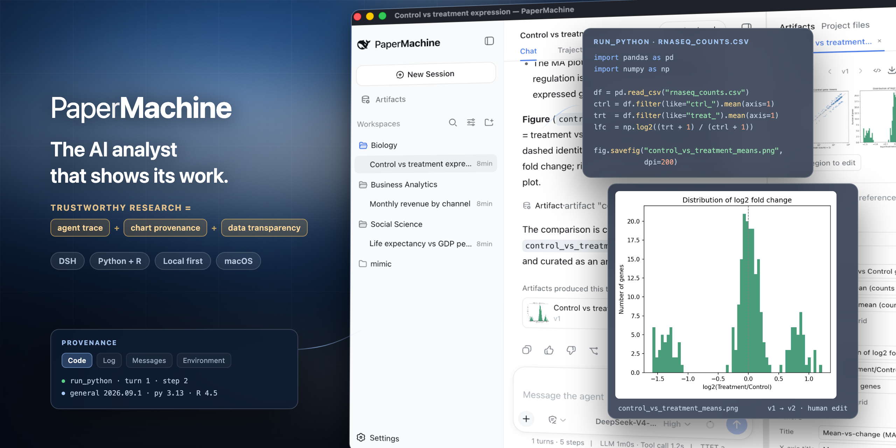
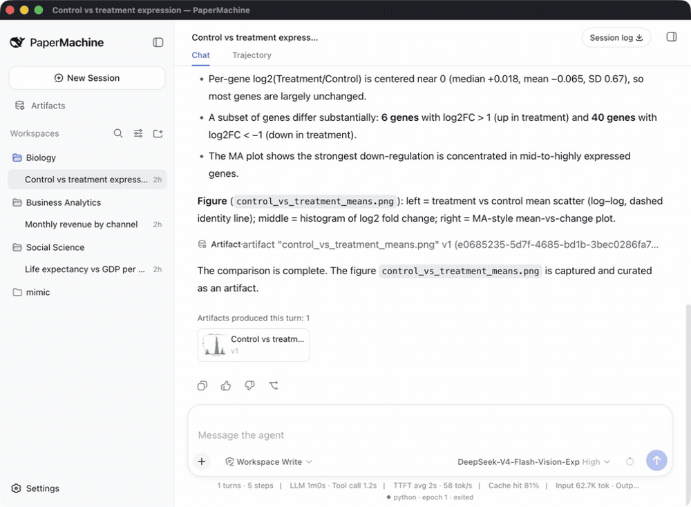
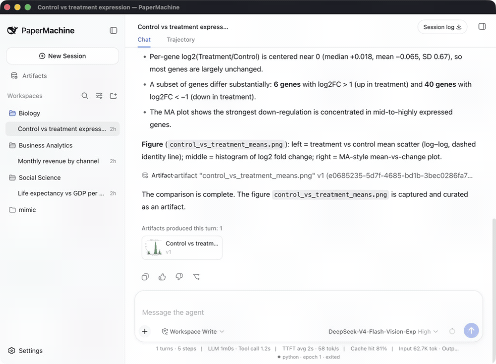
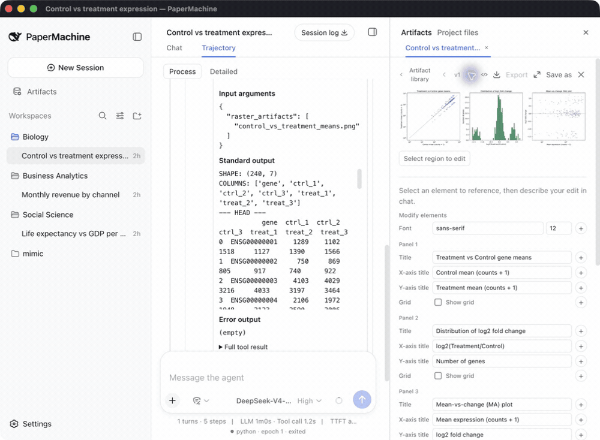
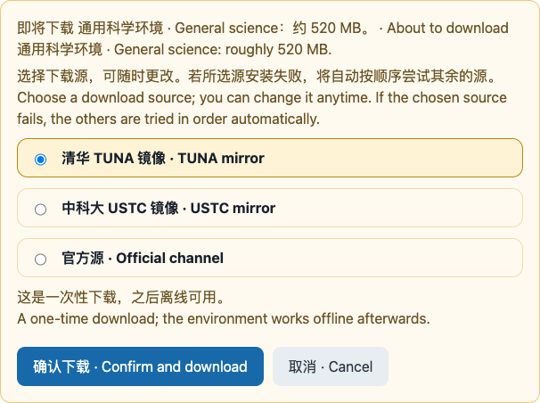

# PaperMachine · 造纸机器

English | [中文](README.zh.md)

**Trustworthy research, done with AI.**

[](https://github.com/SuperJJ007/papermachine/releases/latest)      [](LICENSE)

PaperMachine is a desktop app for everyone whose work runs on data — researchers, business analysts, data analysts. You say what you want in one sentence and it runs Python and R on your own machine. The difference is that the result is not handed to you out of a black box: **agent trace** shows the code it ran and the output it got at every step; **result provenance** takes any figure or table back to the code, the log, and the environment that produced it; **data transparency** keeps every dataset it read and every variable it changed open to inspection. You supervise the AI, and the whole process stays under your control.

<!-- 图 2 · 主循环 GIF ≤30 s:提问 → 运行 → 图出现在右栏 → 结语卡片

-->

## Trace: every step it took is right there



Every turn becomes a strip of steps: read the data, clean it, fit the model, draw the chart. Each step shows only a one-line title and a result badge until you open it; inside is the exact code it ran, its output, and the kernel state. Kernel restarts are marked inline, so you always know when variables were cleared. The Python and R kernels persist across turns, so what you built last turn is still there.

When a reviewer asks how those 600 rows were dropped, the answer is on the screen, not in your memory.

## Artifacts: every chart leads back to where it came from



Every figure, table, and file the model produces lands in the artifact panel on the right, with a version number. One click on any artifact opens its provenance in four tabs: the **code** that produced it, the **log** of that execution, the **question and result** it answered, and the **environment** it ran in — package versions, kernel, timestamp. Artifacts produced in other sessions are traced too.

What you hand over is not just a chart, but everything behind it.

## Chart editing: edit it, keep both versions



You do not have to go back to the code to fix a figure. Change a matplotlib or ggplot2 chart's title, axis labels, legend position, grid, or font directly in a panel — or select a region on the chart and have the model change only that. Saving writes v2 and marks it as a human edit; v1 stays untouched, and you can compare the two at any time.

## Quick start

1. Download your installer from [Releases](https://github.com/SuperJJ007/papermachine/releases/latest): `PaperMachine-<version>-arm64.dmg` for Apple silicon, `PaperMachine-<version>-x64.dmg` for an Intel Mac, `PaperMachine-<version>-x64.exe` for Windows.
2. Open the app and install the environment as described under **First run** below.
3. Open **Settings → Models** and enter your DeepSeek API key. The app ships without one; it calls `deepseek-v4-flash` by default.
4. Drop a CSV, Excel, SPSS, or Stata file into a project and ask your first question, for example: *Plot life expectancy against GDP per capita for 2007, colored by continent.*

### First run

The first time you open PaperMachine it installs its own Python and R environment before opening a workspace. This happens once: afterwards the environment works offline, and later launches go straight to the workspace.



PaperMachine does not use the conda environments already on your machine. It ships its own micromamba and installs into `~/.papermachine`, so what it runs and which packages are present stay exactly known, and your own environments are left alone.

The choices on this screen:

| Option | When to use it |
|---|---|
| **Download and install** | The default path. Installs the 22-package general science environment: about 520 MB to download, 6 GB of free disk needed. |
| **Package source** | Where packages are pulled from. TUNA is preselected when your system language or timezone looks like mainland China, otherwise the official conda-forge channel; you can switch to USTC or either of the others. **Picking the wrong one is not fatal** — if the chosen source fails, the remaining sources are tried in order automatically. |
| **View the full package list** | Read exactly which 22 packages are about to be installed. |
| **Advanced: edit the package list** | Add or remove conda packages in the prefilled list, one per line, `name=version` supported. Removing `python` or `r-base` fails the post-install check. |
| **Keep current environment** | Only appears once an environment is already installed. Reinstalling downloads the 520 MB again, so keep it unless you want a different package list. |

The workspace opens when the install finishes, but you cannot ask anything yet — the model key is yours to enter, as in step 3 above.

Neither installer is code-signed. On macOS, if the system reports the app is damaged or from an unidentified developer, right-click the app and choose **Open**, or run the following once:

```sh
xattr -d com.apple.quarantine /Applications/PaperMachine.app
```

On Windows, SmartScreen warns about an unrecognized publisher: choose **More info**, then **Run anyway**. The installer is per-user and asks for no administrator rights.

## What is inside

<details>
<summary>The general science environment (22 packages)</summary>

| Python 3.13 | R 4.5 |
|---|---|
| NumPy, SciPy, pandas | tidyverse (including ggplot2), data.table |
| Matplotlib, seaborn | broom, modelr, lme4 |
| statsmodels, scikit-learn | survey, srvyr |
| PyArrow, openpyxl, pyreadstat, Pillow | haven, jsonlite |

</details>

<details>
<summary>Skills and tools</summary>

Three bundled skills, invoked by typing `/` in the composer: `scientific-visualization`, `statistical-analysis`, and `scientific-writing`. Your own skills in `~/.papermachine/skills` shadow bundled ones of the same name.

Five science tools the model can call: `run_python`, `run_r`, `get_science_state`, `annotate_artifact`, and `install_science_packages`. The model has read-only access to your workspace and no shell.

</details>

## How it works

<!-- 图 7 · 工作原理小图 1200×600

-->

The window talks to a local host process on your own machine. The host owns one Python kernel and one R kernel per session, a bundled micromamba, and a project-level artifact store. Only model requests leave the machine, to the DeepSeek API with your key.

Everything else stays in `~/.papermachine`: sessions, artifacts, the installed environment, skills, and logs. Deleting that folder removes all of it.

PaperMachine sends three anonymous telemetry events (`app.launch`, `environment.installed`, `environment.install-failed`) carrying an app version, platform, and architecture, and no hostnames, paths, package lists, or error text. Set `DSH_TELEMETRY_DISABLED=1` to turn it off.

## Status and limitations

PaperMachine 0.1 is an early release. Known limitations:

- macOS (Apple silicon and Intel) and Windows (x64). The Windows build is new: it is built and tested on a Windows runner, but no release of it has been through acceptance on a physical Windows machine yet.
- A DeepSeek API key is required; the app ships no key.
- Neither installer is signed; see the notes above.
- Updates are manual: download the next installer.
- There is no variables panel yet; the kernel status bar shows each language's kernel state.

## Roadmap

- Discipline environments, starting with the social sciences.
- A variable history view: shape changes of each dataset across cleaning steps.

## Feedback

Bug reports and analysis questions are welcome in [GitHub Issues](https://github.com/SuperJJ007/papermachine/issues).

## Built on DeepSeek Harness

PaperMachine is assembled from [DeepSeek Harness](https://github.com/deepseek-ai/deepseek-harness) plugins. Developers start with the [development guide](docs/development.md) and [architecture documentation](docs/architecture.md); agents follow [AGENTS.md](AGENTS.md). The desktop carrier is documented in [apps/desktop](apps/desktop/README.md).

### Run

The harness Web UI that PaperMachine wraps starts from a repository checkout; the command prints its URL:

```sh
git clone https://github.com/SuperJJ007/papermachine.git
cd papermachine
pnpm install
pnpm run build
pnpm dsh web
```

### Run from source

The desktop app runs from the same checkout after `pnpm run build`; fetch the pinned micromamba for your architecture first (`darwin-x64` on an Intel Mac, `win32-x64` on Windows):

```sh
pnpm --filter @deepseek-ai/dsh-desktop fetch:micromamba darwin-arm64
pnpm --filter @deepseek-ai/dsh-desktop dev
```

## Acknowledgements

- Bundled skills are vendored from [K-Dense-AI/scientific-agent-skills](https://github.com/K-Dense-AI/scientific-agent-skills) (MIT).
- Screenshots use the [Gapminder](https://www.gapminder.org/data/) dataset (CC BY 4.0).

## License

[MIT](LICENSE)

Third-party dependencies and their licenses are disclosed in [THIRD_PARTY_NOTICES.md](THIRD_PARTY_NOTICES.md).
