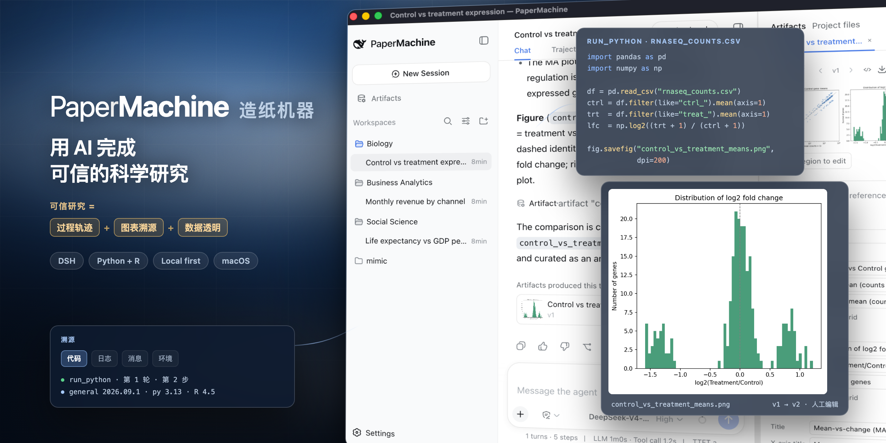
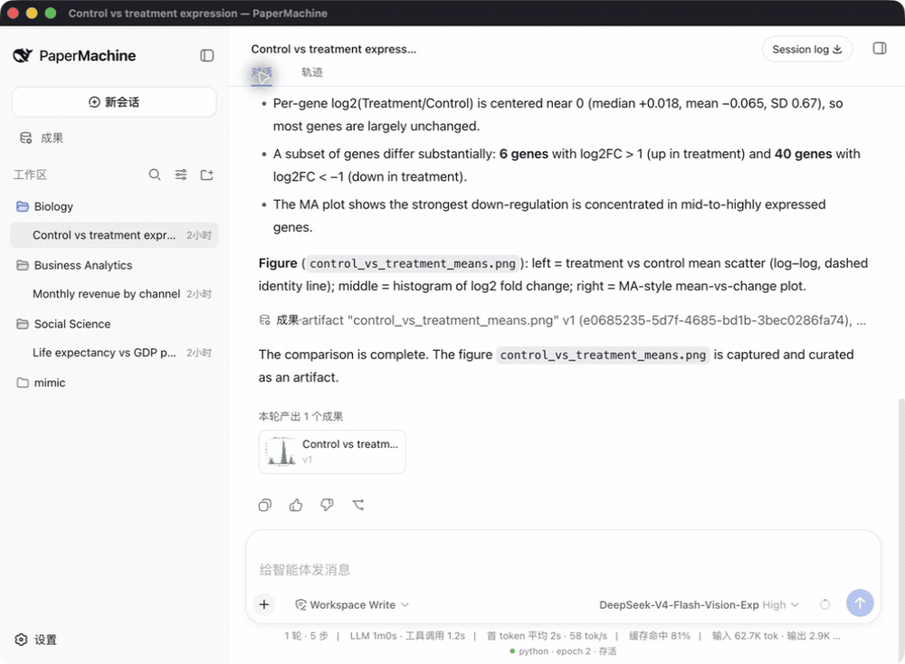
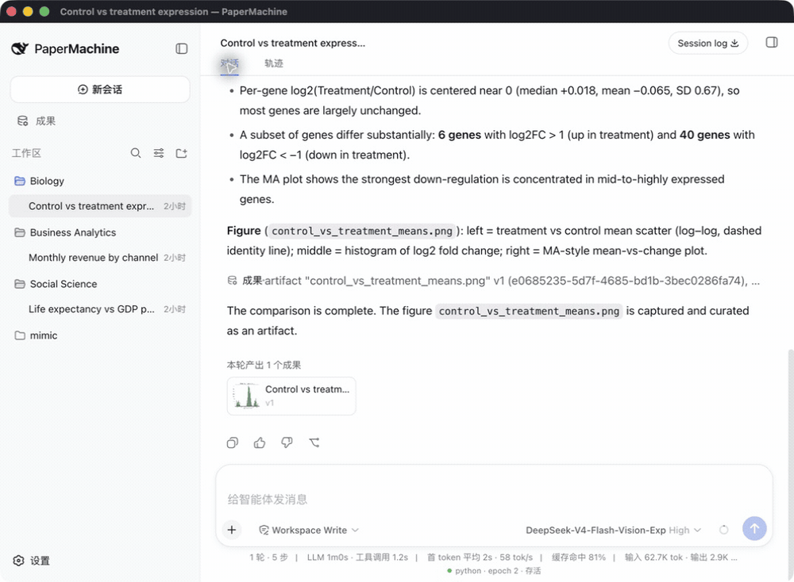
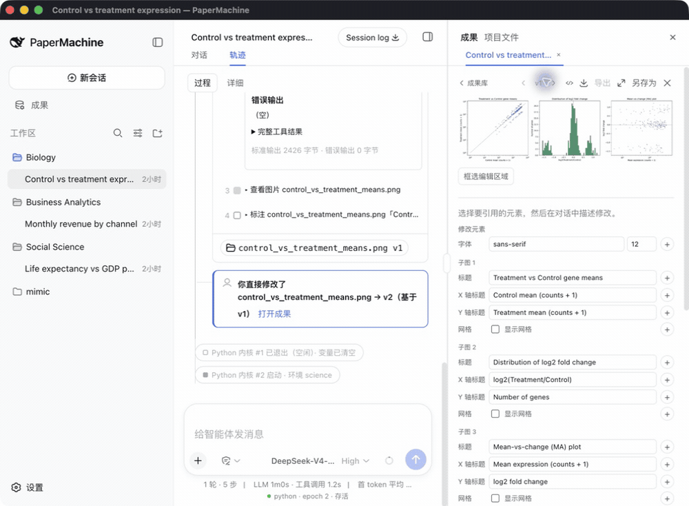

# PaperMachine · 造纸机器

[English](README.md) | 中文

**用 AI 完成可信的科学研究。**

[](https://github.com/SuperJJ007/papermachine/releases/latest)      [](LICENSE)

PaperMachine 是给所有围绕数据工作的人做的桌面应用——科研人员、商业分析师、数据分析师。从查询资料文献、到清理数据、到产出结果，全流程透明可控。

**代码开源**：基于DeepSeek Harness 构建，本地优先，全部透明

**成果溯源**：让任何一张图、一张表都能回到产生它的代码、日志和运行环境

**数据透明**：让它读过的每一份数据、改过的每一个变量都摊开可查

## 轨迹:它做的每一步都在



每一轮对话都变成一条步骤带:读数据、清洗、拟合模型、画图。默认每步只显示一行标题和一个结果徽章,点开才是它真正跑的代码、输出和内核状态。内核重启的位置有标记,所以你总能知道变量是什么时候被清空的。Python 和 R 内核跨轮次保持,上一轮建好的变量下一轮还在。

审稿人问那 600 行是怎么删的,答案在屏幕上,不在你的记忆里。

## 成果:每一张图都能回到它的来处



模型产出的每一张图、每一张表、每一个文件都进入右侧的成果栏,带版本号。从任何一个成果一键打开溯源,四页:产生它的**代码**、那次执行的**日志**、它所回答的**问题与结果**、它运行时的**环境**(包版本、内核、时间)。跨会话产生的成果也追得到。

你交出去的不只是一张图,而是这张图的全部来历。

## 图片编辑:改完保留两个版本



图不用拿回代码里改。在面板里直接改 matplotlib 或 ggplot2 图的标题、坐标轴标签、图例位置、网格和字体;也可以框选图上的一块区域,只让模型改那里。保存写入 v2 并标记为人工编辑,v1 原样保留,两个版本随时对照。

## 快速开始

1. 从 [Releases](https://github.com/SuperJJ007/papermachine/releases/latest) 下载对应你机器的安装包:Apple 芯片用 `PaperMachine-<version>-arm64.dmg`,Intel Mac 用 `PaperMachine-<version>-x64.dmg`,Windows 用 `PaperMachine-<version>-x64.exe`。
2. 打开应用,按下面的**首次运行**装好环境。
3. 打开 **设置 → 模型**,填入你的 DeepSeek API key。应用不附带 key,默认调用 `deepseek-v4-flash`。
4. 把 CSV、Excel、SPSS 或 Stata 文件拖进项目,问出第一个问题,例如:*画出 2007 年各国人均 GDP 与预期寿命的关系,按大洲着色。*

### 首次运行

第一次打开 PaperMachine,它会先装一套属于自己的 Python 与 R 环境,再进工作区。这一步是一次性的:装完之后离线也能用,以后启动直接进工作区。


PaperMachine 不使用你机器上已有的 conda 环境,而是自带一份 micromamba,把环境装在 `~/.papermachine` 里。这样它跑的是什么、装了哪些包,始终是确定的,也不会改变本地已有环境。

这一屏上你要做的选择:

| 选项 | 什么时候用 |
|---|---|
| **下载并安装** | 默认路径。装那套 22 个包的通用科学环境,下载约 520 MB,需要 6 GB 可用磁盘。 |
| **下载源** | 决定从哪里拉包。系统语言或时区看起来在中国大陆时,默认预选清华 TUNA;否则预选官方 conda-forge。你可以随时改选中科大 USTC 或另外两个。**选错了不会卡住**:所选源失败时会按顺序自动试其余的源。 |
| **查看完整包清单** | 装之前先看清楚要装哪 22 个包。 |
| **高级:自定义包清单** | 在预填的清单上增删 conda 包,每行一个,支持 `名称=版本`。删掉 `python` 或 `r-base` 会导致装完的校验失败。 |
| **保留当前环境** | 只在已经装过一次时才出现。重装会再下一遍 520 MB,所以除非要换包清单,保留即可。 |

两个平台的安装包都未做代码签名。macOS 上如果提示应用已损坏或来自身份不明的开发者,右键点击应用选择**打开**,或运行一次下面的命令:

```sh
xattr -d com.apple.quarantine /Applications/PaperMachine.app
```

Windows 上 SmartScreen 会提示发布者无法识别:点**更多信息**,再点**仍要运行**。安装包是 per-user 安装,不需要管理员权限。

## 里面有什么

<details>
<summary>通用科学环境(22 个包)</summary>

| Python 3.13 | R 4.5 |
|---|---|
| NumPy、SciPy、pandas | tidyverse(含 ggplot2)、data.table |
| Matplotlib、seaborn | broom、modelr、lme4 |
| statsmodels、scikit-learn | survey、srvyr |
| PyArrow、openpyxl、pyreadstat、Pillow | haven、jsonlite |

</details>

<details>
<summary>技能与工具</summary>

三个内置技能,在输入框键入 `/` 调用:`scientific-visualization`、`statistical-analysis`、`scientific-writing`。放在 `~/.papermachine/skills` 里的同名技能会覆盖内置的。

模型可调用的五个科研工具:`run_python`、`run_r`、`get_science_state`、`annotate_artifact`、`install_science_packages`。模型对你的工作区只读,且没有 shell。

</details>

## 工作原理

窗口与你机器上的一个本机 Host 进程通信。Host 为每个会话持有一个 Python 内核和一个 R 内核、一份随应用打包的 micromamba,以及项目级的产物存储。只有模型请求离开本机,带着你的 key 发往 DeepSeek API。

其余一切都在 `~/.papermachine` 里:会话、产物、已安装的环境、技能和日志。删掉这个目录就全部清除。

PaperMachine 发送三个匿名遥测事件(`app.launch`、`environment.installed`、`environment.install-failed`),只携带应用版本、平台和架构,不含主机名、路径、包列表或错误文本。设置 `DSH_TELEMETRY_DISABLED=1` 即可关闭。

## 现状与限制

PaperMachine 0.1 是早期版本。已知限制:

- 分析运行支持 macOS(Apple 芯片与 Intel)与 Linux。提供 Windows x64 安装包用于测试桌面载体，但 Science Runtime 目前暂无法在 Windows 上执行 Python 或 R：其内核通信依赖 POSIX FIFO，且沙箱要求全强制等级，Windows 后端目前仅提供部分隔离。应用会在首次启动时说明这一点，而不是下载 520 MB 环境。
- 需要 DeepSeek API key;应用不附带 key。
- 两个平台的安装包都未签名;见上文说明。
- 更新需手动:下载下一个安装包。
- 暂无变量面板;内核状态栏显示每种语言的内核状态。

## 路线图

- Windows 分析运行支持：基于管道的内核传输与 Windows 后端显式沙箱等级策略。
- 学科环境,从社会科学开始。
- 变量变化史视图:每个数据集在各清洗步骤中的形状变化。

## 反馈

欢迎在 [GitHub Issues](https://github.com/SuperJJ007/papermachine/issues) 提交 bug 与分析问题。

## 基于 DeepSeek Harness

PaperMachine 由 [DeepSeek Harness](https://github.com/deepseek-ai/deepseek-harness) 插件组装而成。开发者从[开发指南](docs/development.zh.md)和[架构文档](docs/architecture.zh.md)开始;agent 遵循 [AGENTS.md](AGENTS.md)。桌面载体的文档在 [apps/desktop](apps/desktop/README.zh.md)。

<a id="run"></a>

### 运行

PaperMachine 所包装的 harness Web UI 可以从仓库检出启动;命令会打印其访问地址:

```sh
git clone https://github.com/SuperJJ007/papermachine.git
cd papermachine
pnpm install
pnpm run build
pnpm dsh web
```

<a id="run-from-source"></a>

### 从源码运行

桌面应用在 `pnpm run build` 之后从同一检出运行;先获取对应你架构的固定版本 micromamba(Intel Mac 用 `darwin-x64`,Windows 用 `win32-x64`):

```sh
pnpm --filter @deepseek-ai/dsh-desktop fetch:micromamba darwin-arm64
pnpm --filter @deepseek-ai/dsh-desktop dev
```

## 致谢

- 内置技能引自 [K-Dense-AI/scientific-agent-skills](https://github.com/K-Dense-AI/scientific-agent-skills)(MIT)。
- 截图使用 [Gapminder](https://www.gapminder.org/data/) 数据集(CC BY 4.0)。

## 许可证

[MIT](LICENSE)

第三方依赖及其许可证见 [THIRD_PARTY_NOTICES.md](THIRD_PARTY_NOTICES.md)。
