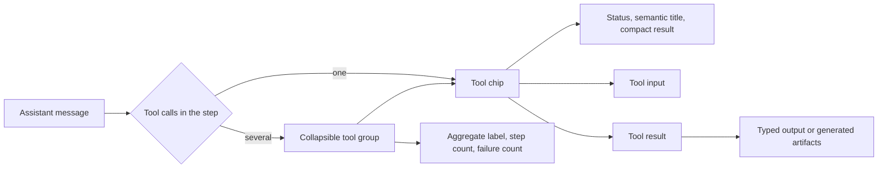
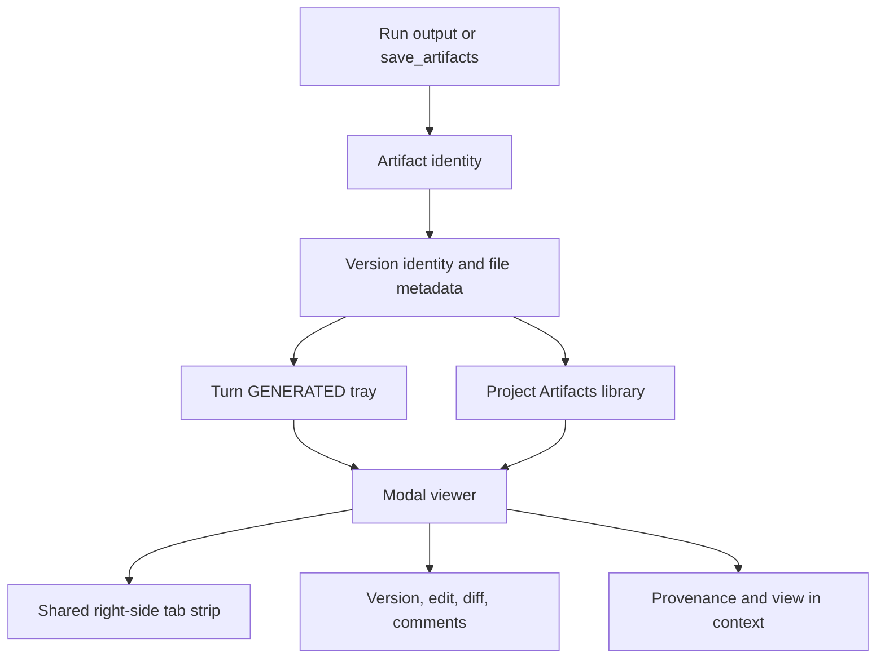

# Claude Science 0.1.25 Agent Trace and artifact UI investigation

English | [中文](2026-08-20-claude-science-agent-trace-artifact-ui.zh.md)

Investigated on 2026-08-20 on macOS 26.5.2 (Darwin 25.5.0, arm64). This record describes the Agent Trace and artifact/Files behavior observed in one read-only Claude Science example session, the installed frontend build that rendered it, and the corresponding source in DSH at `5bcd3f6fb7406c176262dd17bd4616a243475f79`. It is evidence for later product decisions, not the owner of DSH architecture or a promise to reproduce every observed Claude Science feature.

## Investigated identity and scope

| Subject | Exact identity | Scope in this investigation |
|---|---|---|
| Claude Science application | `CFBundleShortVersionString=0.1.25`, `CFBundleVersion=0.1.25`, `CFBundleIdentifier=com.anthropic.operon` | Application identity only; the live page was served by the CSSwitch runtime snapshot below |
| Live Claude Science executable | `/Users/superjj/.csswitch/runtime-snapshots/science/claude-science-63b0f57aa3b9588ba9e61433d27c78df788f8fe2c1b51842db107d6697e9c03f`, SHA-256 `63b0f57aa3b9588ba9e61433d27c78df788f8fe2c1b51842db107d6697e9c03f` | Runtime serving `http://localhost:8990`; located read-only through the live process's open executable |
| Claude Science frontend | `/Users/superjj/.csswitch/sandbox/home/.claude-science/runtime/0.1.25-release/web-dist/` | Minified production JavaScript with no source maps found; this is build evidence, not the original React/TypeScript source |
| Browser session | `http://localhost:8990/projects/proj_example/frames/bd4feaae-21e4-4706-be45-49283555867f` | Existing read-only example session in the user's Chrome; no new analysis run was started |
| DSH source | `main@5bcd3f6fb7406c176262dd17bd4616a243475f79` | Working tree clean at inspection time; the local branch reported 221 commits ahead of the existing local `origin/main` ref, with no fetch performed |
| Existing frontend-design worktree | `design/science-frontend-explore@c878db8109232f68740709142d50d851adcb4248` | Inspected read-only to prevent duplicate planning; no file or ref in that worktree changed |

The browser inspection did not read cookies, local storage, saved passwords, browser profiles, or the Claude Science SQLite database. It exercised only reversible view state: opening and closing trace rows, artifact trays, previews, split tabs, menus, provenance, Files search, and one Markdown edit screen that was cancelled without changing content. Rename, save, star/hide mutation, export, download, and delete actions were not invoked.

## Evidence classes

| Class | Meaning in this record |
|---|---|
| Observed | Visible or accessible state exercised in the live Chrome page |
| Build evidence | Names, state branches, test ids, labels, and actions present in the installed minified JavaScript |
| DSH source | Current behavior stated by source, package READMEs, and active implemented Agent Notes at the investigated DSH SHA |
| Inference | The narrowest explanation consistent with observed and build evidence; not presented as an original-source fact |

The installed asset inventory contained 27 observed script resources. The investigation inspected the following files directly:

| Asset | Bytes | SHA-256 | Relevant evidence |
|---|---:|---|---|
| `index-DOR1-BQW.js` | 3,017,044 | `ea3d0b162f20a76527892745c9d3208dd38bb189f5ac90835e4b05536fda00a8` | Tool chips/groups, turn artifact tray, project artifact library, context menu |
| `ArtifactTile-B6m0wmrb.js` | 54,163 | `4fee2dab553ed498f006a18d4042fbd86c25f95583fa4b8a4fb9a7667173745f` | Viewer actions, editing, version navigation, diff, selection comments, media dispatch |
| `FileBrowserPane-lyD6ezI8.js` | 26,689 | `e1b9b547e7ea7dc7a32ce7e3a74aee27517d1db28018e0aac85c3f7a22414ec0` | Local/scratch/cloud/SSH filesystem browsing and import, distinct from the project artifact library |
| `HtmlPreview-C0mbtGBN.js` | 29,907 | `42839e0395a454367b00629364d7b8556e53960850d0c1b516f6fb7e8916b593` | HTML artifact preview |
| `useExecutionLog-BsiT2EKR.js` | 410 | `554a7ec9777d4caae91200fc2f08aa1cb1f94b094f63e26d29dab0504e9548e1` | Version-aware execution-log query state |

## Agent Trace

### Observed information hierarchy

The example conversation contained 58 `tool-chip` elements, eight `tool-group` elements, and eight `tool-group-header` elements. Tool activity remains in chronological conversation order between assistant prose blocks; Claude Science does not move the complete trace into a separate final log.

A single call renders as one compact chip. A set of calls in one assistant step renders below an aggregate header such as `Ran 2 searches · 2 steps`, `Loaded a skill, set up an environment · 2 steps`, or `Read a file, ran a command · 2 steps · 1 failed`. The group header carries one disclosure state; every child chip retains its own disclosure state.

Each chip combines a lifecycle indicator, a semantic action label, an optional important argument, and a compact result. Observed result summaries included output-line counts, artifact counts, step counts, and salient stdout. A failed child changes both its own indicator and the group's aggregate failure count.

Expanding a chip reveals tool-specific input first and a separately disclosed result. The inspected `python` call showed the environment, complete code, and stdout; the inspected `save_artifacts` call showed expandable array/object arguments and returned artifact JSON. Multiple chips can remain expanded at the same time.

Expanded records carried `data-ann-rootframeid`, `data-ann-msgidx`, `data-ann-msguuid`, `data-ann-blockidx`, and `data-ann-tool`, with distinct `tool_input` and `tool_result` regions. Both children of an inspected group shared the same message index. The evidence supports grouping calls by their owning assistant message or step batch; the exact original state type and grouping function remain unverified because the installed build has no source map.

The installed code has explicit running, backgrounded, success, stopped, and failure branches. The completed example demonstrated success and failure but did not provide a live-running call, so animation timing, transition ordering, and cancellation interaction were not accepted as browser-observed behavior.

### DSH correspondence

DSH already renders each ordered Tool call through the generic or keyed `tool.call.toolview` path, with lifecycle state, recursive subcalls, expandable input/output, specialized cards, file opening, and trajectory inspection; [the ui-tool package contract](../../packages/client/ui-tool/README.md) owns that behavior. DSH also ships a separate [Trajectory ledger](../../packages/client/ui-trajectory/README.md) with Turn and Request structure, search, folding, pagination, virtualization, an inspector, and a timing overview; the [inspection-ledger decision](../../.agents/notes/implemented/feature/2026-07-27-trajectory-inspection-ledger.md) owns its rationale.

The Claude Science pattern therefore does not require a second DSH trace authority. The narrow presentation gap is a Chat projection that groups already-assembled root Tool nodes by their owning assistant step and derives a group label, child count, running state, and failure count while leaving atomic rendering with `ui-tool`. The dedicated Trajectory remains the detailed inspection view.

## Artifacts and Files

### Artifact identity and creation

The inspected `save_artifacts` result returned a stable `artifact_id` and one `version_id`/`version_number`, plus `filename`, `content_type`, `size_bytes`, `checksum`, `storage_path`, `input_path`, `is_checkpoint`, `uri`, `root_frame_id`, and `environment`. This makes the rendered artifact a versioned project object with file bytes and provenance coordinates, not an attachment card derived only from a tool result.

The UI projects that object into three connected layers:

- The assistant turn's `GENERATED · 16` tray showed the first five artifact cards and a `+11 more` control. Expanding it preserved all 16 cards inline. Markdown, image, CSV, JSON, and generic binary artifacts used different previews; CSV exposed approximate rows, columns, and sample field types.
- The left `Files` action opened a project-level page titled `Artifacts`, containing 73 artifacts in the inspected example. It provided search, created-time sorting, Grid/List modes, and sections for Starred, uploads, and producing sessions. This library is distinct from the host filesystem browser represented by `FileBrowserPane`.
- A modal viewer and the right-side split viewer opened the same artifact. The right side used one tab system for `Files` and artifact documents; the inspected tab strip simultaneously held Markdown, Files, PNG, CSV, JSON, and an unavailable binary artifact.

### Viewer behavior and actions

The live viewer rendered Markdown as a document, PNG as an image, CSV as a scrollable table, and JSON as a syntax-highlighted document with line numbers. Opening the example H5AD artifact produced an explicit `Artifact unavailable` state. The evidence does not establish whether its checkpoint status, deletion, unsupported media type, or example-data construction caused the missing artifact.

The library and viewer shared open state: opening `qc_metrics.png` from Files marked its library card open and added or activated the same right-side tab. Closing the Details modal did not close the split tab. Files itself occupied a document tab rather than a permanently separate pane.

The artifact context menu exposed Star/Unstar, Hide, viewer and split opening, View in context, Provenance, Copy link, Rename, Download, Export Metadata, Export to Cloud, and Delete as applicable. Multi-selection code also contains Download All as ZIP. These labels establish available commands; only viewer/split opening, View in context, and Provenance were exercised.

Opening a Markdown artifact exposed an Edit action. Edit mode contained the source text, Cancel, and `Save as new version`; Save remained disabled with `No changes to save` until content changed. The installed `ArtifactTile` code also contains previous/next version controls, version selection, comparison against another version, preview/change toggling, and text-selection comments. The investigation cancelled edit mode and did not create a version or annotation, so persistence, conflict handling, and diff accuracy remain unverified.

Provenance opened inside the Artifact Viewer with a breadcrumb and Code/Review views. The inspected PNG reported `No reproduction code` and `No checks run yet`. `View in context` activated the producing session and moved the conversation near the relevant frame, but it did not visibly land on the exact `save_artifacts` call; exact call anchoring is therefore unverified.

### DSH correspondence

DSH's Science artifact is session-scoped and durable. `ScienceArtifactVersion` carries `artifactId`, `logicalName`, contiguous `version`, title/caption origin, attachment, source run, `toolCallId`, `requestHeaderSeq`, environment revision/fingerprint, and commit time; [the Science subsystem types](../../packages/science/science-session/src/types.ts) own the field definitions. [The per-request version decision](../../.agents/notes/implemented/architecture/2026-08-19-artifact-version-per-request-turn.md) defines one visible version as the final content one request turn produced, while same-turn rewrites and metadata-only curation supersede that visible version.

[The ui-science package](../../packages/client/ui-science/README.md) renders run references, curated artifact rows, Outcome evidence, and a read-only Details viewer. Its per-session [selection store](../../packages/client/ui-science/src/client/selection-store.ts) owns open artifact tabs, the active version, content/provenance mode, provenance sub-tab, and lightbox state. The viewer supports PNG, CSV, JSON, Markdown, and plain text; its provenance views resolve code, execution log, Messages/trajectory inspection, and environment. `ui-science` and `ui-trajectory` are both present in the shipped Web composition at [the Web app patch](../../packages/bundle/web-app/cordis.patch.yml).

## Product comparison

| Product concern | Claude Science 0.1.25 evidence | DSH at the investigated SHA | Gap or constraint |
|---|---|---|---|
| Chat trace | Assistant-step groups containing atomic Tool chips | Atomic root/subcall Tool rows in Chat | Add a group projection and group summary; keep atomic rows authoritative |
| Detailed trajectory | No separate detailed ledger was investigated | Dedicated Turn/Request ledger, timing overview, search, folding, and inspector | Retain the DSH view; do not replace it with the compact Chat trace |
| Turn artifacts | One generated-artifact tray attached to the final assistant result | Run rows expose captured artifact references; Outcome exposes cited evidence | A unified per-turn generated tray is absent |
| Artifact ownership | Project-level object visible across producing sessions | Science projection and viewer are session-scoped | Project ownership, indexing, and authorization require a product decision before UI work |
| Library | Search, sort, Grid/List, sections, star/hide, uploads, and actions | No project-level artifact library found | Requires a project query/index and user metadata, not only a new component |
| Viewer workspace | Modal plus shared right-side tabs containing Files and artifacts | Science Details column with package-local artifact tabs | A cross-feature document workspace and tab owner are absent |
| Media | Observed Markdown, PNG, CSV, JSON, and unavailable H5AD; build code names additional media | PNG, CSV, JSON, Markdown, and plain text | Extend only with admitted storage/read contracts and bounded renderers |
| Editing | Markdown edit, new version, version comparison, and selection-comment code | Viewer is explicitly read-only; versions come from runs or model curation | Human-authored versions and conflict semantics need a durable write design |
| Provenance | Root frame/environment, Viewer provenance, review state, and coarse context navigation | Exact run, Tool call, Request header, code/log/message/environment linkage | DSH linkage is stronger, but retained environment history is currently only the latest revision |

## Recommendations

1. Treat compact Chat trace grouping as a presentation change over the existing conversation Tool nodes. Define group membership, aggregate state, summary generation, folding, accessibility, streaming, and failure behavior without introducing a second event fold.
2. Keep Trajectory as the detailed inspection destination. A Tool chip or artifact provenance action can use the existing exact call inspection path instead of duplicating payload and timing detail inside Chat.
3. Decide project-level artifact ownership before implementing a Claude-style Files library. The decision must name cross-session identity, project membership, query/index authority, user metadata such as star/hide, authorization, deletion, retention, and how a session-scoped `ScienceArtifactVersion` becomes or references a project object.
4. Define a shared document-workspace owner separately from the artifact domain. Files, artifacts, and future documents can share tabs and split placement only if one client package owns tab identity, activation, close fallback, persistence across reload, and unavailable-document state.
5. Preserve DSH's exact provenance coordinates when adding project and editing features. Human edits, imports, annotations, and derived versions need explicit authorship and source relationships rather than weakening the existing run/Tool/Request/environment linkage.

These recommendations are not accepted architecture. Substantial implementation should begin with one or more proposed Agent Notes whose acceptance criteria bind the chosen scope to current DSH source and browser behavior.

## Unverified and out of scope

- Original Claude Science React/TypeScript source, source maps, backend source, database schema, and API authorization logic were unavailable and were not inferred from the minified frontend beyond the behavior stated above.
- The exact grouping reducer, live-running transitions, background execution recovery, cancellation controls, and concurrency ordering were not observed in an active run.
- Artifact version conflict resolution, edit persistence, annotation persistence, bulk operations, cloud export, delete recovery, link sharing authorization, and cross-session artifact retention were not executed.
- The investigation did not establish whether Claude Science's project artifact and file-browser models share a backend store; their UI modules and responsibilities are visibly distinct.
- No DSH product code, test, build artifact, browser fixture, worktree ref, credential, Science environment, or release state changed during this investigation.

## Checks recorded for this document

The document change is documentation-only. Its verification record is reported by the change that adds this file; no historical Claude Science observation becomes a DSH source, build, browser, installed-runtime, or release PASS.
