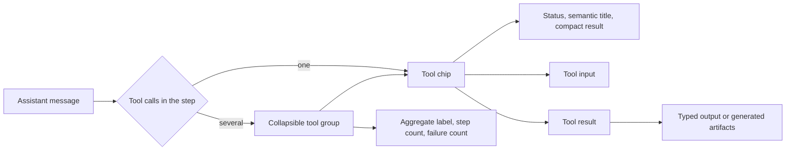
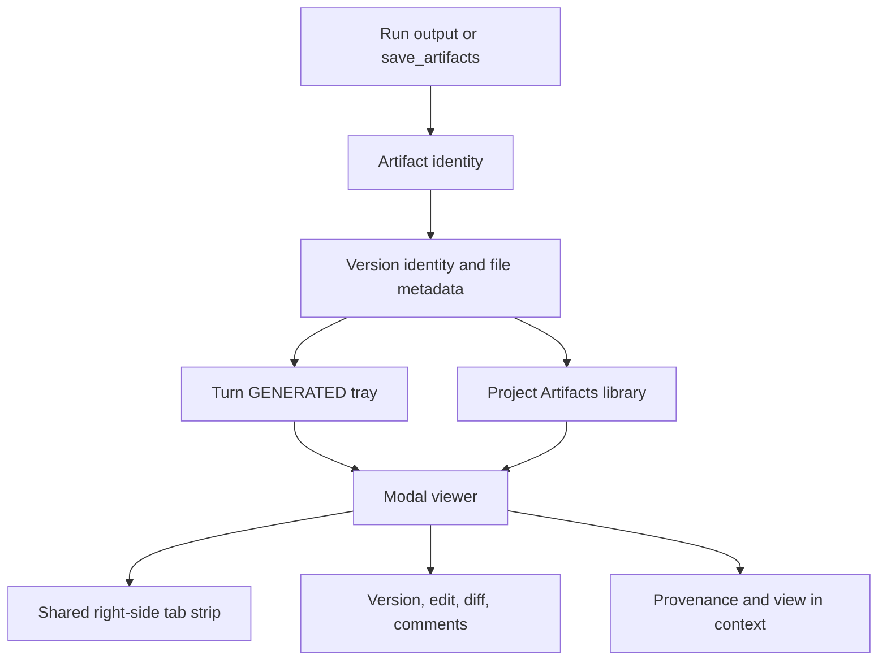

# Claude Science 0.1.25 Agent Trace 与产物 UI 调查

[English](2026-08-20-claude-science-agent-trace-artifact-ui.md) | 中文

本次调查于 2026-08-20 在 macOS 26.5.2（Darwin 25.5.0，arm64）上进行。本记录描述一个只读 Claude Science 示例会话中的 Agent Trace、产物与 `Files` 行为，渲染该页面的已安装前端构建，以及 DSH 在 `5bcd3f6fb7406c176262dd17bd4616a243475f79` 上的对应源码。它为后续产品决策提供证据，但不负责定义 DSH 当前架构，也不承诺复刻每项已观察到的 Claude Science 功能。

## 调查身份与范围

| 对象 | 精确身份 | 本次调查范围 |
|---|---|---|
| Claude Science 应用 | `CFBundleShortVersionString=0.1.25`、`CFBundleVersion=0.1.25`、`CFBundleIdentifier=com.anthropic.operon` | 仅确认应用身份；实时页面由下方 CSSwitch 运行时快照提供 |
| 实时 Claude Science 可执行文件 | `/Users/superjj/.csswitch/runtime-snapshots/science/claude-science-63b0f57aa3b9588ba9e61433d27c78df788f8fe2c1b51842db107d6697e9c03f`，SHA-256 为 `63b0f57aa3b9588ba9e61433d27c78df788f8fe2c1b51842db107d6697e9c03f` | 提供 `http://localhost:8990` 的运行时；通过实时进程打开的可执行文件以只读方式定位 |
| Claude Science 前端 | `/Users/superjj/.csswitch/sandbox/home/.claude-science/runtime/0.1.25-release/web-dist/` | 未发现 source map 的压缩生产 JavaScript；这是构建证据，不是原始 React/TypeScript 源码 |
| 浏览器会话 | `http://localhost:8990/projects/proj_example/frames/bd4feaae-21e4-4706-be45-49283555867f` | 用户 Chrome 中已有的只读示例会话；没有启动新的分析运行 |
| DSH 源码 | `main@5bcd3f6fb7406c176262dd17bd4616a243475f79` | 调查时工作树干净；本地分支相对既有本地 `origin/main` ref 显示领先 221 个提交，本次未执行 fetch |
| 既有前端设计 worktree | `design/science-frontend-explore@c878db8109232f68740709142d50d851adcb4248` | 以只读方式检查以避免重复规划；该 worktree 中没有文件或 ref 发生变化 |

浏览器调查没有读取 cookie、local storage、已保存密码、浏览器 profile 或 Claude Science SQLite 数据库。调查只操作可逆的查看状态：打开和关闭 Trace 行、产物托盘、预览、分屏标签、菜单、溯源、`Files` 搜索，以及进入一次 Markdown 编辑界面后在未改内容的情况下取消。没有调用 Rename、Save、Star/Hide 变更、Export、Download 或 Delete。

## 证据分类

| 分类 | 本记录中的含义 |
|---|---|
| 已观察 | 在实时 Chrome 页面中实际操作并看到或从可访问状态读取的行为 |
| 构建证据 | 已安装压缩 JavaScript 中存在的名称、状态分支、test id、标签和动作 |
| DSH 源码 | 调查所绑定 DSH SHA 上的源码、包 README 和活跃的已实现 Agent Note 所陈述的当前行为 |
| 推断 | 与已观察证据和构建证据一致的最窄解释；不作为原始源码事实陈述 |

已安装资源清单包含 27 个已观察到的 script 资源。本次调查直接检查了以下文件：

| 资源 | 字节数 | SHA-256 | 相关证据 |
|---|---:|---|---|
| `index-DOR1-BQW.js` | 3,017,044 | `ea3d0b162f20a76527892745c9d3208dd38bb189f5ac90835e4b05536fda00a8` | 工具 chip/group、轮次产物托盘、项目产物库、上下文菜单 |
| `ArtifactTile-B6m0wmrb.js` | 54,163 | `4fee2dab553ed498f006a18d4042fbd86c25f95583fa4b8a4fb9a7667173745f` | Viewer 动作、编辑、版本导航、diff、选区评论、媒体分派 |
| `FileBrowserPane-lyD6ezI8.js` | 26,689 | `e1b9b547e7dc7a32ce7e3a74aee27517d1db28018e0aac85c3f7a22414ec0` | local/scratch/cloud/SSH 文件系统浏览与导入，区别于项目产物库 |
| `HtmlPreview-C0mbtGBN.js` | 29,907 | `42839e0395a454367b00629364d7b8556e53960850d0c1b516f6fb7e8916b593` | HTML 产物预览 |
| `useExecutionLog-BsiT2EKR.js` | 410 | `554a7ec9777d4caae91200fc2f08aa1cb1f94b094f63e26d29dab0504e9548e1` | 感知版本的执行日志查询状态 |

## Agent Trace

### 已观察到的信息层级

示例对话包含 58 个 `tool-chip` 元素、8 个 `tool-group` 元素和 8 个 `tool-group-header` 元素。工具活动按时间顺序保留在 assistant 说明文字之间；Claude Science 没有把完整 Trace 移到末尾的独立日志中。

一次调用渲染为一个紧凑 chip。同一 assistant 步骤中的一组调用渲染在聚合标题下，例如 `Ran 2 searches · 2 steps`、`Loaded a skill, set up an environment · 2 steps` 或 `Read a file, ran a command · 2 steps · 1 failed`。group 标题持有一份展开状态；每个子 chip 仍保留自己的展开状态。

每个 chip 组合生命周期指示、语义化动作标签、可选的关键参数和紧凑结果。观察到的结果摘要包括输出行数、产物数、步骤数和关键 stdout。一个子项失败时，它自身的指示和 group 的聚合失败数都会变化。

展开 chip 后先显示工具专用输入，再显示可单独展开的结果。已检查的 `python` 调用显示环境、完整代码与 stdout；已检查的 `save_artifacts` 调用显示可展开的数组/对象参数和返回的产物 JSON。多个 chip 可以同时保持展开。

展开记录携带 `data-ann-rootframeid`、`data-ann-msgidx`、`data-ann-msguuid`、`data-ann-blockidx` 与 `data-ann-tool`，并带有分离的 `tool_input` 和 `tool_result` 区域。一个已检查 group 的两个子项共享同一个消息索引。证据支持按所属 assistant 消息或步骤批次对调用分组；由于已安装构建没有 source map，原始状态类型和分组函数仍未验证。

已安装代码包含明确的 running、backgrounded、success、stopped 与 failure 分支。已完成的示例展示了成功和失败，但没有提供正在运行的调用，因此动画时序、状态转换顺序和取消交互没有被接受为浏览器已观察行为。

### 与 DSH 的对应关系

DSH 已经通过通用或 keyed `tool.call.toolview` 路径渲染每个有序工具调用，包括生命周期状态、递归 subcall、可展开输入/输出、专用卡片、文件打开与 Trajectory 检查；该行为由 [ui-tool 包约定](../../packages/client/ui-tool/README.md)负责。DSH 还提供独立的 [Trajectory ledger](../../packages/client/ui-trajectory/README.md)，支持 Turn 与 Request 结构、搜索、折叠、分页、虚拟列表、Inspector 和时间概览；其理由由 [inspection-ledger 决策](../../.agents/notes/implemented/feature/2026-07-27-trajectory-inspection-ledger.md)负责。

因此，Claude Science 模式不要求 DSH 再建立一套 Trace 真源。当前狭窄的展示缺口，是把已经组装好的根工具节点按所属 assistant 步骤投影成 Chat group，并推导 group 标签、子项数量、运行状态和失败数，同时让 `ui-tool` 继续负责原子渲染。独立 Trajectory 继续作为详细检查视图。

## 产物与 Files

### 产物身份与创建

已检查的 `save_artifacts` 结果返回稳定的 `artifact_id`、一个 `version_id`/`version_number`，以及 `filename`、`content_type`、`size_bytes`、`checksum`、`storage_path`、`input_path`、`is_checkpoint`、`uri`、`root_frame_id` 与 `environment`。因此，所渲染产物是带文件字节和溯源坐标的版本化项目对象，不是仅从工具结果派生的附件卡片。

UI 把这个对象投影到三个互相连接的层级：

- assistant 轮次下的 `GENERATED · 16` 托盘首先显示 5 张产物卡和 `+11 more` 控件。展开后，16 张卡都保留在对话内。Markdown、图像、CSV、JSON 与通用二进制产物使用不同预览；CSV 会提前显示近似行数、列数与示例字段类型。
- 左侧 `Files` 动作打开标题为 `Artifacts` 的项目级页面；已检查示例包含 73 个产物。页面提供搜索、按创建时间排序、Grid/List 模式，以及 Starred、上传和生成会话分区。该产物库与 `FileBrowserPane` 所代表的宿主文件系统浏览器不同。
- Modal Viewer 与右侧 split viewer 打开同一个产物。右侧让 `Files` 和产物文档使用同一套标签系统；已检查标签条同时包含 Markdown、Files、PNG、CSV、JSON 和一个不可用的二进制产物。

### Viewer 行为与动作

实时 Viewer 把 Markdown 渲染为文档、PNG 渲染为图像、CSV 渲染为可滚动表格、JSON 渲染为带行号的语法高亮文档。打开示例 H5AD 产物时出现明确的 `Artifact unavailable` 状态。证据无法确定缺失原因是 checkpoint 状态、删除、不支持的媒体类型还是示例数据构造。

产物库与 Viewer 共享打开状态：从 Files 打开 `qc_metrics.png` 会把其 library card 标记为已打开，并添加或激活同一个右侧标签。关闭 Details modal 不会关闭 split 标签。Files 自身占用一个文档标签，而不是永久独立面板。

产物上下文菜单按适用情况提供 Star/Unstar、Hide、打开 Viewer 与 split、View in context、Provenance、Copy link、Rename、Download、Export Metadata、Export to Cloud 和 Delete。多选代码还包含以 ZIP 形式执行 Download All。这些标签证明命令存在；本次只实际操作了打开 Viewer/split、View in context 与 Provenance。

打开 Markdown 产物后会出现 Edit 动作。编辑模式包含源文本、Cancel 和 `Save as new version`；内容未变时，Save 保持禁用并显示 `No changes to save`。已安装 `ArtifactTile` 代码还包含上一/下一版本、版本选择、与另一版本比较、预览/变更切换和文本选区评论。本次调查取消了编辑，没有创建版本或注解，因此持久化、冲突处理和 diff 准确性仍未验证。

Provenance 在 Artifact Viewer 内打开，包含 breadcrumb 与 Code/Review 视图。已检查 PNG 显示 `No reproduction code` 和 `No checks run yet`。`View in context` 激活生成该产物的会话，并把对话移动到相关 frame 附近，但没有明显落到精确的 `save_artifacts` 调用；因此，精确调用锚定仍未验证。

### 与 DSH 的对应关系

DSH 的 Science 产物是会话范围内的持久化对象。`ScienceArtifactVersion` 携带 `artifactId`、`logicalName`、连续 `version`、标题/说明来源、附件、源 run、`toolCallId`、`requestHeaderSeq`、环境 revision/指纹和提交时间；字段定义由 [Science subsystem 类型](../../packages/science/science-session/src/types.ts)负责。[按请求划分版本的决策](../../.agents/notes/implemented/architecture/2026-08-19-artifact-version-per-request-turn.md)把一个可见版本定义为一个请求轮次最终产生的内容；同轮次重写与仅元数据策展会覆盖该可见版本。

[ui-science 包](../../packages/client/ui-science/README.md)渲染 run 引用、策展产物行、Outcome 证据与只读 Details Viewer。它的每会话 [selection store](../../packages/client/ui-science/src/client/selection-store.ts)负责已打开产物标签、当前版本、content/provenance 模式、溯源子标签和 lightbox 状态。Viewer 支持 PNG、CSV、JSON、Markdown 与纯文本；溯源视图解析 code、execution log、Messages/Trajectory 检查和 environment。`ui-science` 与 `ui-trajectory` 都已出现在 [Web app patch](../../packages/bundle/web-app/cordis.patch.yml)定义的 Web 组合中。

## 产品对照

| 产品关注点 | Claude Science 0.1.25 证据 | 调查 SHA 上的 DSH | 缺口或约束 |
|---|---|---|---|
| Chat Trace | assistant 步骤 group 包含原子工具 chip | Chat 中的原子根工具/subcall 行 | 增加 group 投影与 group 摘要；原子行继续作为渲染真源 |
| 详细 Trajectory | 本次没有调查独立的详细 ledger | 独立的 Turn/Request ledger、时间概览、搜索、折叠与 Inspector | 保留 DSH 视图；不要用紧凑 Chat Trace 替换它 |
| 轮次产物 | 最终 assistant 结果附带一个 generated-artifact 托盘 | Run 行暴露捕获产物引用；Outcome 暴露所引证据 | 缺少统一的每轮次 generated 托盘 |
| 产物归属 | 可跨生成会话查看的项目级对象 | Science 投影与 Viewer 都是会话范围 | 项目归属、索引和授权必须先形成产品决策，再开展 UI 工作 |
| Library | 搜索、排序、Grid/List、分区、star/hide、上传与动作 | 未发现项目级产物库 | 需要项目查询/索引和用户元数据，不只是新组件 |
| Viewer 工作区 | Modal 加共享右侧标签，Files 与产物并列 | Science Details column 加包内产物标签 | 尚无跨功能文档工作区与标签所有者 |
| 媒体类型 | 已观察 Markdown、PNG、CSV、JSON 与不可用 H5AD；构建代码还命名了其它媒体 | PNG、CSV、JSON、Markdown 与纯文本 | 只在存储/读取约定允许且渲染有界时扩展 |
| 编辑 | Markdown 编辑、新版本、版本比较与选区评论代码 | Viewer 明确只读；版本由 run 或模型策展产生 | 人工版本与冲突语义需要持久化写入设计 |
| 溯源 | Root frame/environment、Viewer provenance、review 状态与粗粒度上下文导航 | 精确的 run、工具调用、Request header、code/log/message/environment 关联 | DSH 关联更强，但当前只保留最新 environment revision 的历史 |

## 建议

1. 把紧凑 Chat Trace group 视为现有 conversation 工具节点上的展示改动。在不引入第二套事件折叠逻辑的前提下，定义 group 归属、聚合状态、摘要生成、折叠、可访问性、流式更新与失败行为。
2. 让 Trajectory 继续作为详细检查入口。工具 chip 或产物溯源动作可以复用现有精确调用检查路径，不必在 Chat 内重复载荷和时序详情。
3. 在实现 Claude 风格 `Files` 产物库前，先决定项目级产物归属。决策必须定义跨会话身份、项目成员关系、查询/索引权威、star/hide 等用户元数据、授权、删除、保留策略，以及会话范围的 `ScienceArtifactVersion` 如何成为或引用项目对象。
4. 把共享文档工作区的所有者与产物领域分开定义。只有一个客户端包明确负责标签身份、激活、关闭后的回退、重载持久性和文档不可用状态时，Files、产物与未来文档才能安全共享标签和 split 布局。
5. 添加项目和编辑功能时，保留 DSH 的精确溯源坐标。人工编辑、导入、注解和派生版本需要明确的作者身份与来源关系，不能削弱已有的 run/Tool/Request/environment 关联。

以上建议不是已接受架构。任何大范围实现都应先形成一个或多个 proposed Agent Note，并让其验收标准绑定当前 DSH 源码和浏览器行为。

## 未验证与超出范围事项

- 原始 Claude Science React/TypeScript 源码、source map、后端源码、数据库 schema 与 API 授权逻辑不可用；除上述行为外，本记录没有从压缩前端推断这些内容。
- 本次没有在活跃 run 中观察精确分组 reducer、实时 running 转换、后台执行恢复、取消控件与并发顺序。
- 本次没有执行产物版本冲突处理、编辑持久化、注解持久化、批量操作、cloud export、删除恢复、链接分享授权与跨会话产物保留。
- 本次调查没有确认 Claude Science 的项目产物模型与文件浏览器模型是否共享同一个后端 store；二者的 UI 模块和职责明显不同。
- 本次调查没有改变任何 DSH 产品代码、测试、构建产物、浏览器 fixture、worktree ref、凭证、Science 环境或发布状态。

## 本文档记录的检查

本文档改动仅涉及文档。添加本文档的变更负责报告其验证记录；任何历史 Claude Science 观察都不构成 DSH 源码、构建、浏览器、已安装运行时或发布层面的 PASS。
