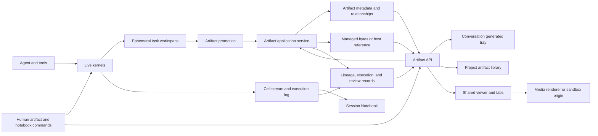
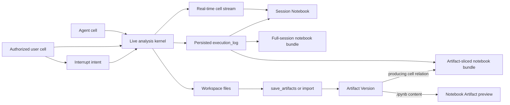
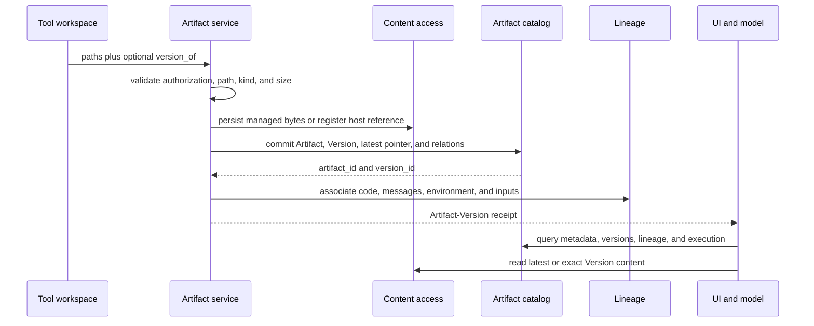
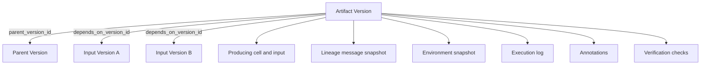
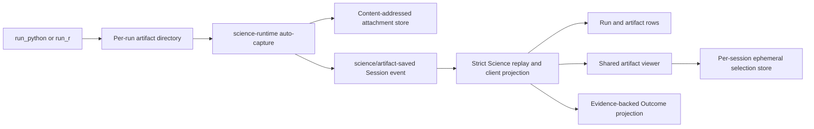

# Claude Science 0.1.25 artifact, notebook, and presentation architecture, data flow, and DSHscience alignment

English | [中文](2026-08-22-claude-science-artifact-architecture.zh.md)

This reference describes the Claude Science 0.1.25 Artifact, Notebook, and presentation models and their relationship to DSHscience at `d6f934ae66bd347cc7eb937eb2d2ce9fce65c122`. It records current architecture and interaction semantics. The DSH alignment sections are design input, not an accepted DSH architecture decision.

## Executive conclusion

Claude Science organizes artifacts as a project catalog over conversation-owned logical objects. A logical Artifact has stable identity, mutable organization metadata, and a latest-Version pointer. An Artifact Version records content metadata, a parent-Version reference, and production provenance. Managed Version bytes are immutable; a reference-backed Version is an explicit exception because it reads a currently authorized host file whose content may change.

The Session Notebook is a separate execution projection, not another Artifact owner. It joins live kernel state with persisted cell records under a conversation root, groups work by agent frame, environment, and kernel instance, and permits user cells only against a live analysis kernel. An `.ipynb` becomes an Artifact only when it is explicitly saved or imported; opening that file does not reconnect its original kernel.

Separate records own dependency edges, execution records, annotations, verification results, folders, and reusable lineage/environment snapshots. The conversation tray, project library, viewer tabs, version navigator, editor, downloads, and provenance views resolve those shared identities rather than maintaining independent file-card models.

DSHscience already has the stronger byte-storage and replay foundation: content-addressed immutable attachments, required session events, strict replay, exact run/environment/tool-call provenance, persistent per-Session language kernels, request-turn Artifact Versions, evidence-backed Outcome revisions, and one client projection. Its missing layer is project-level artifact organization, richer Version relationships, and a notebook read/export surface over existing run truth, not another attachment, execution-log, or viewer authority.

## Claude Science architecture



The architecture has seven cooperating parts:

1. **Kernel execution.** Python, R, shell, and control-plane cells run under an agent frame. Live analysis kernels expose a shared namespace to the agent and an authorized human terminal.
2. **Execution projection.** Live cell updates and persisted execution records form a Session Notebook grouped by agent, environment, and kernel instance. It is a view over execution, not a saved notebook document.
3. **Execution workspace.** Cells and other tools write ordinary files into a task workspace. A workspace file is temporary until an Artifact operation promotes it.
4. **Artifact promotion.** `save_artifacts`, import, upload, and human editing turn content into project Artifact/Version records and return stable identifiers.
5. **Artifact catalog.** Project, conversation root, Artifact identity, filename, priority, folder, retention, latest Version, and Version metadata belong to the durable catalog.
6. **Content and provenance.** A Version points to managed bytes or an explicitly authorized host-file reference. Version ancestry, dependencies, cell lineage, annotations, and verification are separate records joined by ids.
7. **Presentation.** The Session Notebook, conversation trays, project library, viewers, editing, downloads, and provenance resolve shared frame, cell, Artifact, and Version identities. HTML uses a separate sandbox origin from the application UI.

## Domain model

| Record | Identity and ownership | Material fields | Lifecycle meaning |
|---|---|---|---|
| `frames` | One conversation or delegated-agent execution scope; every session has a root frame. | `id`, `parent_frame_id`, `root_frame_id`, agent identity, status, project ownership. | Groups messages, kernels, cells, and produced Artifacts under the main or delegated agent that performed the work. |
| Live kernel instance | Runtime identity under one frame, language, and environment. | kernel id, frame id, language, environment, starting/busy state, current cell, last use. | Owns a live namespace. When it ends, its namespace disappears and only execution records remain. |
| Session Notebook view | A root-frame-scoped read model with no independent durable notebook id. | selected agent frame, environment, live or ended kernel instance, streamed and persisted cells. | Presents execution and permits user cells only for a live analysis kernel; it is not an Artifact Version. |
| `artifacts` | One project-scoped logical object tied to a producing conversation root and optional frame/folder. | `id`, `project_id`, `root_frame_id`, `frame_id`, `filename`, `latest_version_id`, upload/ephemeral/branch flags, priority, folder, retention, supersession, rename history. | Mutable organization metadata and the current-Version pointer; not the content record. |
| `artifact_versions` | One content publication under an Artifact. | `id`, `artifact_id`, `version_number`, content type, size, checksum, storage reference, `parent_version_id`, code/messages/environment metadata, producing cell, language, checkpoint/intermediate flags. | Exact managed bytes or a reference-backed content descriptor plus production context. `(artifact_id, version_number)` is unique. |
| `artifact_dependencies` | Directed Version-to-Version edge. | `artifact_version_id`, `depends_on_version_id`, optional `reference_name`. | Input/data dependency graph; distinct from Version ancestry. |
| `artifact_folders` | Project hierarchy with optional conversation binding. | `project_id`, `parent_id`, `root_frame_id`, conversation-folder and uploads-folder flags, order. | Project organization and conversation/upload groupings. |
| `content_snapshots` | Content-addressed lineage or environment snapshot. | hash, content, byte count, creation time. | Reuses identical provenance payloads across Versions. |
| `execution_log` | One persisted cell/process record inside a frame. | cell and kernel ids, environment, language, source, stdout/stderr, status, files read/written, origin, detection, intervention. | Historical notebook content and Artifact production context after a live cell settles. |
| `annotations` | Project record targeting an Artifact-Version selection or another supported target. | target kind/key, label, content checksum, body, timestamps. | Review comments and selected-text edits remain separate from Version content until an edit is applied. |
| `verification_checks` | Review assertion optionally bound to an Artifact Version or claim. | verdict, severity, evidence, rebuttal, reviewer identity/kind, source reference, status, resolution. | Scientific review lifecycle, not content versioning. |
| `.ipynb` Artifact Version | A normal Artifact Version whose content is a notebook file. | Managed/reference-backed notebook JSON, checksum, size, and ordinary Artifact provenance. | Read-only file preview and download; it does not own or restore a live kernel namespace. |

Four relations have different meanings:

- `artifact_versions.parent_version_id` is content/edit ancestry. A later numeric Version may name an older parent rather than the immediately preceding number.
- `artifact_dependencies` is the provenance graph of inputs consumed to produce a Version.
- `artifacts.superseded_by_artifact_id` relates replacement logical Artifacts.
- `artifacts.latest_version_id` is a mutable convenience pointer, not ancestry.

## Notebook architecture and data flow

Claude Science uses “notebook” for two different products that share execution provenance but not identity:

| Notebook concept | Identity and source | Mutable behavior | Artifact effect |
|---|---|---|---|
| Session Notebook | Conversation `root_frame_id`, selected agent frame, environment, and kernel instance; composed from live kernel status, real-time cell updates, and `execution_log`. | A live analysis kernel accepts user Python/R cells into the same namespace as the agent and supports interruption. Ended kernels and Agent SDK cells are read-only. | None by itself. Files written by cells remain workspace files until promotion. |
| Notebook bundle export | Derived from the Session Notebook execution records, either for the full session or sliced to cells associated with one Artifact Version. | Request-generated ZIP with `manifest.json`, `README.md`, `run.sh`, one `notebook.ipynb` per included agent/kernel segment, and applicable replay, environment, input, and output files; it does not become the live Notebook's state. | None unless the bundle or a contained file is explicitly saved or imported. |
| `.ipynb` Artifact | Exact content of an Artifact Version classified as a notebook. | Read-only preview of Markdown, code, streams, errors, rich text, and supported images; ordinary Version download/history rules apply. | Already an Artifact Version. Opening it never reconnects a kernel or changes the Session Notebook. |



The live Notebook first selects the main or delegated agent frame, then an environment/language group, then a live or ended kernel instance. Cells from the active kernel stream into the same ordered view as settled execution records. User-submitted cells carry human origin, share the selected live kernel's variables and imports, and enter the execution history when settled. A terminated kernel remains selectable as a read-only history, but its namespace no longer exists.

The control-plane/Agent SDK execution channel is exposed as a separate read-only notebook segment. Host-tool records are not notebook cells. Shell execution can appear in the session-level execution history/export but is not an interactive shared analysis-kernel terminal.

Notebook bundle export is a projection, not a second history store. Both scopes return a ZIP with `manifest.json`, `README.md`, `run.sh`, one `notebook.ipynb` per included agent/kernel segment, and applicable replay, environment, input, and output files. Full scope includes the Session's executable cell history. Artifact-sliced scope keeps the same archive model while selecting cells through the Version's producing-cell relationships. The Artifact and exact Version ids remain the durable join from a bundled notebook cell back to content.

Notebook Artifact preview reads the exact Version bytes and parses notebook JSON. It bounds preview size and cell count, sanitizes rich HTML, and renders supported text/image outputs without executing the document. Editing or rerunning a saved `.ipynb` therefore requires a separate compute workflow and a new explicit Artifact save.

## Presentation architecture, style, and layout

### Workspace composition

The interface assigns project navigation, the active conversation, and secondary work to stable regions. Artifact and Notebook surfaces reuse the secondary workspace shell but retain separate selections and lifecycle rules.

```text
Wide
┌─────────────┬────────────────────┬──────────────────────────┐
│ Project /   │ Session tabs       │ Artifact / Notebook tabs │
│ session nav │ Conversation       │ Context toolbar          │
│             │ Generated tray     │ Viewer or cell stream    │
│             │ Pinned composer    │ Terminal when live       │
└─────────────┴────────────────────┴──────────────────────────┘

Narrow
┌─────────────┬───────────────────────────────────────────────┐
│ Sidebar /   │ Conversation + composer                       │
│ Library     ├───────────────────────────────────────────────┤
│             │ Artifact Viewer or Notebook                   │
└─────────────┴───────────────────────────────────────────────┘
```

| Region | Layout and ownership | Interaction role |
|---|---|---|
| Project/session navigation | A collapsible leading column contains the project selector, creation and discovery commands, files/compute entry points, and grouped sessions. | Changes project or conversation context; it does not own Artifact content or viewer state. |
| Conversation workspace | Session tabs sit above the transcript. The generated-Artifact tray appears with the producing response, while the composer remains at the lower edge of the conversation region. | Owns conversational context and the entry points that open exact Artifact or Notebook selections. |
| Secondary workspace | A trailing tab strip hosts Artifact and Notebook work. Artifact tabs can use one pane or a split arrangement and return to one strip. | Holds focused review and execution views without replacing the conversation. |
| Context toolbar | Viewer- or Notebook-specific controls sit inside the selected secondary tab, next to the object they affect. | Keeps Version, provenance, download, fullscreen, kernel, and interrupt actions scoped to the active selection. |
| Transient status | Notifications occupy a floating upper-corner layer rather than changing the three-region geometry. | Reports completion and failure without becoming durable Artifact or execution state. |

### Artifact presentation

The conversation presents generated Artifacts as a compact tray: preview cards show representative content and filenames, and an overflow affordance opens the remaining items. Inline Artifact links in the response and tray cards resolve the same catalog identities. Tray and project-library selections open an Artifact modal over the current work. The same Artifact-Version selection can then open or activate in a secondary tab or split; modal and workspace views do not maintain separate Artifact identities.

The Artifact workspace combines a tab identity, a small context header, and a renderer selected by media type. Images and document previews use a spacious neutral canvas; text, code, tabular data, and notebook files use content-specific readers. Version navigation and content/provenance mode belong to the Viewer, while download, fullscreen, and close actions remain in its toolbar. The project library is a separate discovery surface, but its cards and rows open the same Artifact-Version selection.

### Notebook presentation

The Session action opens a Notebook modal for historical review and export. Its header identifies the Session root and summarizes agent/cell counts; its body groups the recorded cells; its footer owns the Notebook bundle ZIP download. This modal does not expose a live terminal.

The Notebook workspace tab is the operational surface. Its header names the Notebook and selected environment/language, adding agent and kernel-instance selectors when more than one choice exists. The body renders the ordered cell stream. For a live analysis kernel, the pane is divided vertically between cells and a shared terminal with a draggable separator; kernel state and interrupt controls remain adjacent to that terminal. An ended kernel keeps the same cell presentation but becomes explicitly read-only and states that its namespace is gone.

### Visual system and responsive behavior

| Concern | Stable presentation rule |
|---|---|
| Surface hierarchy | White and off-white work surfaces, pale neutral selection fills, hairline separators, and small-to-medium corner radii distinguish navigation, transcript, cards, and focused work without heavy chrome. |
| Color and state | A restrained accent color identifies links and active controls. Running, busy, error, and ended states pair color or a dot with text or a badge rather than relying on color alone. |
| Typography | Sans-serif text carries navigation, conversation, labels, and metadata. Monospaced text carries cell code, identifiers, kernel output, and terminal content. |
| Density | Navigation and generated-Artifact trays are compact; the transcript preserves reading width; the Artifact canvas gives media room; Notebook cells and terminal controls remain information-dense. |
| Control hierarchy | Persistent navigation uses icon-and-label controls. Compact toolbar actions can be icon-only when they have an accessible name or tooltip. Controls remain inside the region whose state they mutate. |
| Media treatment | Thumbnail cards preserve quick recognition, while the Viewer centers the selected media and preserves its aspect ratio. Rich HTML renders on a sandbox origin separate from application chrome. |
| Responsive layout | When horizontal space cannot sustain the wide arrangement, the secondary workspace stacks below the conversation and project/library controls compact independently. Reflow changes placement, not Artifact-Version or Notebook-kernel identity. |

## Artifact creation and save flow

`save_artifacts` accepts this operation model:

```text
save_artifacts({
  files: string[],
  language: "python" | "r" | "bash" | "text",
  version_of?: Record<string, artifact_id | version_id>,
  environment?: string,
  checkpoints?: string[],
  destination?: Record<string, "snapshot" | "working_data">
})
```

One call uses one language. `version_of` explicitly maps a filename to an Artifact or Version; callers must not infer it from a similar filename. `checkpoints` marks expensive-to-regenerate serialized state rather than presentation output. `destination` declares retention intent.



Promotion rejects paths outside the authorized workspace or host grant, empty or unreadable inputs, and unsupported file kinds. Content and metadata become visible together as one committed Artifact-Version operation; a failed promotion does not expose a contentless Artifact as a completed result.

Managed content is checksummed and may reuse an existing same-project content location when checksum and size match. Deduplication shares physical bytes without merging Artifact or Version identities. A reference-backed Version instead stores a host reference and revalidates current grant and path containment on read; it does not prove that the referenced file remains byte-identical to its saved checksum.

Without `version_of`, a save resolves the logical Artifact by project, producing frame, and filename or creates a new Artifact. With `version_of`, it records the named Artifact or exact Version as the base. A stale base can still produce the next numeric Version while retaining the explicit older parent; content is not automatically merged.

The operation returns Artifact and Version ids, version number, filename, content type, size, checksum, content location, checkpoint status, environment, conversation root, and retention information. Model-visible Markdown can pin an exact Version with `{{artifact:VERSION_ID}}`.

## Artifact operations and interaction semantics

| Operation | API operation | Semantics |
|---|---|---|
| Project and conversation lists | `GET /api/projects/{project_id}/artifacts`, `GET /api/frames/{root_frame_id}/artifacts` | Project library and conversation tray query the same catalog identities; intermediate and user-hidden entries stay outside normal presentation. |
| Latest and exact content | `GET /api/artifacts/{artifact_id}`, `GET /api/artifacts/versions/{version_id}` | Latest follows the mutable pointer; exact Version resolves the named Version. Managed content is stable, while host-reference content may change outside the catalog. |
| Metadata and history | `GET /api/artifacts/{artifact_id}/metadata`, `GET /api/artifacts/{artifact_id}/versions` | Display metadata and ordered Version history are separate queries. |
| Human text save | `POST /api/artifacts/{artifact_id}/versions` | Creates a Version from content, content type, and explicit `parent_version_id`. |
| Rename and priority | `PATCH /api/artifacts/{artifact_id}/rename`, `PATCH /api/artifacts/{artifact_id}/priority` | Mutate logical Artifact metadata without creating content Versions. |
| Copy | `POST /api/artifacts/{artifact_id}/copy` | Creates a new branch-mint Artifact at version 1 and can share the source content location. |
| Organization | Folder operations, the per-Artifact folder operation, and `POST /api/artifacts/bulk-move` | Move logical Artifacts through the project hierarchy without changing content. |
| Provenance | Artifact/Version lineage operations and frame execution-log query | Fetch production context independently from content. |
| Annotation and edit | Artifact-Version annotation, `suggest-edits`, and `apply-edit` operations | Anchor review to an exact Version; applying content creates a Version rather than mutating stored managed bytes. |
| Live Session Notebook | Session-kernel query, execution-log query, and real-time cell/control channel | Merge live and settled cells by root frame, agent frame, environment, and kernel instance; user execution and interrupt target only a selected live analysis kernel. |
| Notebook bundle export | `GET /api/frames/{root_frame_id}/bundle?scope=full` or `scope=sliced&versionId={version_id}` | Return a ZIP with per-agent/kernel notebooks and execution support files for the full Session or the cells associated with one Artifact Version, without creating an Artifact or new execution history. |
| Notebook Artifact preview | Exact Version text read for `.ipynb` content | Render a bounded, sanitized, non-executing preview under ordinary Artifact download and Version rules. |
| Download/export | Latest/Version download, selected zip, conversation zip, and cloud transfer operations | Stream catalog content without making the viewer a storage owner. |

Version numbers give chronological order; `parent_version_id` gives edit ancestry. For example, v2 and v3 can both name v1 as parent. A version stepper may follow numeric order, while ancestry and default parent diff follow the parent link.

Copy and rename have different identity effects. Copy creates a new Artifact identity at version 1 and may share content with the source. Rename changes the logical Artifact filename and leaves its Versions unchanged.

## Retention and content semantics

| Mechanism | Architecture rule | Product consequence |
|---|---|---|
| Managed Version | Content is stored under service control and addressed through its Version. | Suitable for immutable scientific evidence and durable publication. |
| Host-reference Version | Content is read from a currently authorized host path; authorization and containment are rechecked, but unchanged bytes are not guaranteed. | Materialize or integrity-check it before treating it as immutable evidence. |
| `snapshot` retention | Every saved Version remains addressable under the normal retention policy. | Appropriate for results, reports, figures, and auditable output. |
| `working_data` retention | A successful save requests pruning to the latest working copy. Cleanup failure does not roll back the new Version, so pruning is best-effort. | A retention intent, not a strict storage or history bound. |
| Intermediate Version | `is_intermediate` keeps internal work outside normal project/conversation lists. | Debugging residue does not automatically become reader-facing output. |
| Checkpoint | `is_checkpoint` marks serialized state intended to avoid expensive regeneration. | Runtime/provenance state, not a presentation category. |
| Content deduplication | Same-project managed content with matching checksum and size can share storage while logical ids remain distinct. | Deletion and garbage collection must be reference-aware. |

User uploads and branch-minted copies retain Version history rather than using `working_data`. Very large mutable working sets belong in user-managed storage unless the Artifact operation declares an appropriate destination.

## Provenance and review

Claude Science maintains Version ancestry and data dependency as separate graphs:



Lineage can carry the producing cell, a conversation slice, environment state, input mappings, and dependency edges. Reusable message/environment payloads are content-addressed. A lineage result can be complete, pending, or partially mapped without changing the Version's content identity.

Execution records own cell input, environment/kernel facts, stdout/stderr, files read/written, origin, detection, and user intervention. Verification records independently attach a verdict, evidence, rebuttal, reviewer, and resolution status to a Version or claim. Annotations use the Version and content checksum to detect a stale selection.

## Unified interaction model

The interaction is unified because every entry point resolves the same domain ids:

- A tool save returns `artifact_id` and `version_id`; the conversation tray displays that exact Version.
- The project library queries Artifacts across producing conversations and organizes them with folders, search, priority, and uploads.
- Modal and split viewers open the same Artifact and pin or step an exact Version; they do not clone tray-card state.
- Edit creates a Version, rename changes Artifact metadata, copy creates a new Artifact, and annotation creates a separate anchored review record.
- Provenance and “view in context” join a Version to its producing conversation, cell, messages, environment, and inputs.
- The Session Notebook opens by conversation root and kernel selection; an Artifact opens by exact Version. Producing-cell relations bridge them without collapsing their identities.
- Full and Artifact-sliced Notebook downloads are derived ZIP bundles. A bundle or contained `.ipynb` enters the catalog only through an explicit Artifact operation.
- The filesystem browser remains separate: import promotes a filesystem entry into the Artifact catalog rather than treating the mutable filesystem as the library.

Visual consistency follows this identity model. A viewer shell without shared ids and operation semantics would remain a separate product model.

## DSHscience current architecture

At `d6f934ae66bd347cc7eb937eb2d2ce9fce65c122`, DSH separates four authorities:



| DSH component | Current ownership and semantics |
|---|---|
| [`@deepseek-ai/dsh-attachment-local`](../../packages/attachment/attachment-local/README.md) | Immutable SHA-256 objects, atomic durable publication, cross-media byte deduplication, and verified reads. Session logs contain opaque references rather than Host paths. |
| [`@deepseek-ai/dsh-science-runtime`](../../packages/science/science-runtime/README.md) | Persistent Python/R execution, a per-run artifact directory, and bounded auto-capture of admitted image/text files after the terminal run fact. Capture failure does not change the committed run result. |
| [`@deepseek-ai/dsh-science-session`](../../packages/science/science-session/README.md) | Required `science/*` events, strict replay, branded ids, complete Artifact Version values, exact run/environment/tool-call provenance, a browser-safe projection, and attachment authorization. |
| `annotate_artifact` | Reuses the exact attachment and replaces the named projected Version's title/caption metadata; it does not create duplicate bytes or a reader-visible content Version. |
| `publish_outcome` | Appends a contiguous Outcome revision with exact references to successful runs, Artifact Versions, and/or prior messages. Outcome is a publication over evidence, not the byte store. |
| [`@deepseek-ai/dsh-client-ui-science`](../../packages/client/ui-science/README.md) | Reads one Science projection for transcript entries, gallery, tabs, Version navigation, content, download, and provenance. Its per-session store owns only viewing state. |
| Notebook surface | Persistent Python/R kernels and their `kernelEpoch` identities exist, but there is no live Session Notebook, direct human cell channel, or full/sliced Notebook bundle export. Cell input and output presentation currently joins Science run facts to transcript tool occurrences rather than reading a standalone notebook record. |

DSH defines an Artifact Version as the content one request turn produced, as owned by the [request-turn Artifact Version decision](../../.agents/notes/implemented/architecture/2026-08-19-artifact-version-per-request-turn.md). Auto-capture skips byte-identical output; changed output written repeatedly in the same tool-call turn replaces the projected Version, while changed output in a later turn opens the next contiguous Version. Every save event remains in the Session log. Metadata curation keeps the Version number and bytes unchanged.

DSH Artifacts are currently session-scoped. The Science domain has no project Artifact catalog, folder/upload/copy/rename lifecycle, explicit parent-Version link, Version dependency graph, anchored human annotation, verification record, or project-wide retention/garbage-collection policy. These are product gaps, not reasons to replace the attachment store or Session projection.

## Claude Science and DSH comparison

| Dimension | Claude Science 0.1.25 | DSH at `d6f934a` | Alignment input |
|---|---|---|---|
| Primary scope | Project catalog with producing conversation ownership. | Session projection only. | Add a project catalog/index without duplicating Session production truth. |
| Logical identity | Stable Artifact id; mutable filename, folder, priority, retention, and latest pointer. | Stable `ScienceArtifactId`; logical name and presentation metadata live on projected Versions. | Introduce explicit logical Artifact metadata ownership before project actions. |
| Version semantics | Every save/edit creates a numeric Version; explicit parent may branch from an older Version. | One reader-visible Version per request turn; same-turn saves and metadata curation replace projection. | Retain DSH agent semantics; add explicit parent for cross-turn and human content edits. |
| Content storage | Managed Version content plus optional host-reference content; managed content can deduplicate within a project. | Global content-addressed immutable attachment store with verified references. | Keep DSH storage; model any external reference as a separate non-immutable content class. |
| Creation boundary | Workspace content becomes durable through save, import, upload, or human edit. | Eligible run artifact files auto-promote after run settlement. | Preserve auto-capture as one producer behind a shared Artifact operation. |
| Session Notebook | Live and ended kernels are grouped by agent/environment/instance; live analysis kernels accept human cells; full and Version-sliced Notebook bundles derive from execution history. | Persistent per-Session Python/R kernels and durable run/kernel identities, but no unified Notebook view, human cell execution, or Notebook bundle export. | Build a read/bundle-export projection over Session and transcript truth; do not create a second execution history. |
| `.ipynb` Artifact | A saved notebook file is an ordinary Version with a bounded, non-executing preview. | `.ipynb` is not currently an admitted auto-capture media type or a dedicated Science viewer. | Treat notebook files as explicit managed Artifacts separately from the live execution view. |
| Provenance | Parent graph, dependency graph, cell/message/environment lineage, execution log. | Exact run, request, tool call, environment, code hash, kernel epoch, and transcript join. | Preserve DSH coordinates and add typed dependency/parent relations. |
| Human editing | Text edit creates Version; annotations and apply-edit are Version-aware. | Read-only viewer; `annotate_artifact` is metadata curation. | Treat content editing and metadata curation as different operations. |
| Organization | Project folders, conversation folders, uploads, search, star/hide, copy, rename, delete/export. | Latest-Version gallery inside one Session. | Project organization belongs in a catalog capability, not client viewing state. |
| Presentation | Conversation tray, project library, shared viewer, exact Version navigation and provenance. | Transcript rows and one Details viewer over the Session projection. | Reuse one Artifact reference and viewer registration across entry points. |
| Layout and visual hierarchy | Collapsible project/session navigation, a conversation workspace, and a tabbed secondary workspace; narrow layouts stack focused work below the conversation. | Conversation shell with an optional Details panel; Science content uses the shared client theme and viewer registration. | Reuse one responsive shell and theme vocabulary while adding library and Notebook entry points; do not create a parallel Artifact viewer. |
| Publication | Artifacts are first-class; verification attaches to Versions. | Outcome is a separate evidence-backed publication revision. | Keep Outcome separate and let exports reference or materialize Artifacts. |
| Retention | Snapshot, best-effort working-data pruning, intermediate/checkpoint classes, project deduplication. | Capture caps; attachment objects retained indefinitely. | Add explicit retention and reference-aware garbage collection without weakening immutable evidence. |

## Recommended unified semantics

This section is input for a future proposed Agent Note, not current DSH authority.

### Separate records and owners

| Record | Recommended owner | Required meaning |
|---|---|---|
| Artifact | Project Artifact catalog | Stable logical identity, project/Session ownership, display name, folder, user priority/visibility, latest published Version. |
| Artifact Version | Durable Science/Session event plus project index | Managed immutable attachment reference, product Version, optional parent Version, exact producing run/turn/tool/environment, origin, media metadata, creation time. |
| External Content Reference | Filesystem/grant capability | Explicitly mutable host content with current authorization and integrity status; never presented as an immutable Version blob without materialization. |
| Notebook Execution View | Science Session query/projection capability | Root Session, exact run/tool call, language, kernel epoch, cell input/output occurrence, live status, and optional human-cell origin; no independent durable notebook id. |
| Dependency Edge | Artifact provenance service | Typed `depends-on` edge between exact Versions with reference name and resolution status. |
| Annotation and Verification | Review service | Exact Version/checksum anchor, author/reviewer, status, and optional applied-edit result Version. |
| Outcome | Science publication domain | Immutable revision citing exact runs, Artifact Versions, and messages; never a mutable alias for latest content. |
| Viewer State | Client package-local store | Open tabs, active `artifactId@version`, content/provenance mode, selection, and lightbox state only. |

Session events remain the truth for what a run produced and what the model published. The project catalog owns cross-Session discovery and mutable organization facts while indexing immutable managed Version references. The attachment provider remains the managed-byte authority. The browser owns no durable Artifact facts.

### Operation matrix

| User or agent intent | Unified operation | Version effect |
|---|---|---|
| Agent writes the same logical output repeatedly in one request turn | Record each event and project only the final same-turn value. | Keep the current product Version number; retained event history preserves iterations. |
| Agent changes output in a later turn | Save against latest or an explicit base. | Create the next Version with a parent reference. |
| Human edits Version content | Save an explicit edit based on the Version being viewed. | Create a Version whose parent is the viewed Version; expose a stale-base branch/conflict instead of implying the prior number is its parent. |
| Model or human changes title/caption only | Curate logical/Version metadata with its own provenance. | Do not create a content Version. |
| User renames, stars, hides, or moves | Mutate project catalog metadata. | Do not create a content Version. |
| User copies an Artifact | Create a new logical Artifact with a copy/branch provenance edge and shared managed blob reference. | New Artifact starts at version 1; source remains unchanged. |
| User comments on a selection | Create an annotation anchored to exact Version plus checksum/range. | No Version until an edit is applied. |
| User applies an annotation edit | Invoke the human edit operation. | Create a child Version and retain the annotation as review provenance. |
| Agent publishes a result | Publish Outcome with exact references. | Outcome revision advances independently; cited Artifact Versions remain fixed. |
| User opens the Session Notebook | Resolve Session, run, and kernel identities into a live/historical execution view. | No Artifact Version; no duplicate execution record. |
| User exports a full or Artifact-sliced Notebook bundle | Materialize a derived ZIP with per-segment notebooks and applicable execution support files from exact run/cell records. | No Artifact Version unless the user explicitly saves/imports the bundle or a contained file. |
| User saves an `.ipynb` as project output | Promote the notebook bytes through the shared Artifact operation. | Create or advance an Artifact Version; the file remains separate from the live kernel namespace. |

This hybrid retains DSH's request-turn history while adding explicit edit ancestry. Numeric sequence provides ordering; the parent field provides ancestry.

### Shared interaction reference

Artifact entry points exchange one serializable selection: project id, Artifact id, exact Version id or number, and an explicit follow-latest flag only where live following is intended. Notebook entry points instead exchange root Session/frame, exact run or cell where relevant, language, and kernel instance/epoch. The producing-cell relation is the explicit bridge between these selections; filename and display order are not joins. Transcript references and Outcome citations pin exact Versions. Project cards may follow latest until opened. Rename/folder/priority commands address the Artifact; edit/download/provenance/annotation commands address an exact Version.

The project library, conversation tray, Outcome references, search results, and viewer call the same catalog/query capability and open the same viewer registration. The Session Notebook calls one execution query/projection and combines durable records with live kernel updates. Wide, split, modal, and narrow stacked layouts retain those selections instead of creating layout-local copies. No entry point reconstructs Artifact state from tool-result text, filename, or a private card cache, and notebook state never becomes a competing Artifact catalog.

### Provenance minimum

A DSH managed Version retains `runId`, `toolCallId`, `requestHeaderSeq`, environment revision/fingerprint, code hash, and kernel epoch, then adds `parentVersionId`, `producingCellId` or an equivalent exact run/cell join, typed dependency edges, origin, and project/Session ownership. Optional message/environment snapshots remain content-addressed and bounded. Execution input and output stay with Session/transcript run records and join by id; a Notebook bundle snapshots those records without becoming their authority.

### Retention and garbage collection

Keep DSH's SHA-256 attachment objects and apply policy to references: immutable evidence snapshots, replaceable working data, checkpoints, and intermediate visibility. Garbage collection deletes an object only after every Session event, project Version, Outcome export, annotation edit, and external reference releases it. Project copy adds a reference rather than copying bytes. No policy prunes a Version cited by an Outcome or verification record.

### Capability packaging

The project Artifact catalog is a complete capability seam: a Service Definition for Artifact/Version queries and commands, a Provider for durable project metadata and indexing, and Consumers for capture/import tools and client entry points. The attachment service remains the byte seam; Science Session remains the production-event owner; ui-science remains a Consumer.

## Suggested implementation slices

1. **Domain decision.** Write a proposed Agent Note that defines Artifact, Version, managed blob, external reference, request-turn versus human-edit versioning, command targets, relation types, and Outcome separation.
2. **Project catalog seam.** Add Service Definition, local Provider, replay/index reconciliation, branded ids, and authorization without changing the viewer first.
3. **Producer integration.** Make auto-capture and future import/upload return the same Artifact-Version receipts while preserving Session events and content-addressed attachments.
4. **Notebook read model and export.** Compose Session run/kernel facts with transcript cell input/output occurrences, then add a root-Session execution view and deterministic full/sliced Notebook bundle ZIP export. Keep any future direct human-cell channel separately authorized and durably logged.
5. **Unified client entry points.** Add a project library and conversation-generated tray that open the existing viewer through the same `artifactId@version` selection; let exact producing-run links open the Notebook view, retain selection across wide and stacked layouts, and keep filesystem browsing separate.
6. **Human operations.** Add rename/folder/priority/copy, then exact-Version editing and anchored annotations, each through an assembled application path.
7. **Provenance and retention.** Add parent/dependency views, reference-aware retention/garbage collection, and verification integration after identity and authorization are stable.

Each slice updates its package README and JSDoc, rejects invalid transitions in unit coverage, verifies persistence and attachment authorization through e2e coverage, and updates a keyless assembled-application snapshot for model- or product-visible behavior.

## Rejected shortcuts

- **Make tool-result attachments the Artifact model.** Tool results are transcript occurrences; they cannot own project organization, cross-Session discovery, edits, or stable latest/Version semantics.
- **Use filename as identity.** Rename, copy, duplicate names, and explicit branching require ids independent of paths and display names.
- **Store Artifact bytes in the client or viewer.** This duplicates authorization, durability, integrity, and cache ownership.
- **Treat the host filesystem browser as the Artifact library.** Workspace files are mutable execution inputs; Artifacts are promoted results with provenance and publication semantics.
- **Replace DSH's content-addressed store with an Artifact-id path layout.** Project identity belongs in metadata, while content identity belongs in the attachment store.
- **Advance a content Version for title/caption changes.** Metadata-only curation would reintroduce duplicate reader history.
- **Let latest stand in for evidence.** Transcript production, Outcome citations, annotations, diffs, and verification pin exact Versions.
- **Make the live Session Notebook a saved Artifact.** Live execution state, derived Notebook bundles, and immutable `.ipynb` files have different identities and lifecycles.

## Scope limits

- This reference covers the local Claude Science 0.1.25 Artifact domain; cloud transfer, remote compute, multi-user coordination, and account lifecycle are outside its scope.
- A reference-backed Claude Science Version is not an immutable scientific record unless its bytes are materialized or reverified against a persisted integrity value.
- `working_data` expresses retention intent and best-effort pruning; it is not a strict history or disk-usage bound.
- Lineage can be pending or partially mapped, so consumers handle incomplete dependencies and unavailable execution/review records.
- The Session Notebook is an execution projection; only an explicitly promoted `.ipynb` is an Artifact Version, and an Artifact notebook preview never restores a live namespace.
- The presentation section records region ownership, visual hierarchy, and responsive behavior rather than a pixel specification or theme-token inventory.
- The DSH recommendations require a proposed Agent Note and review before implementation.
