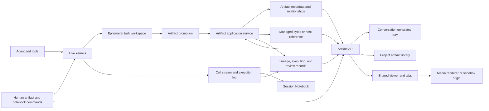
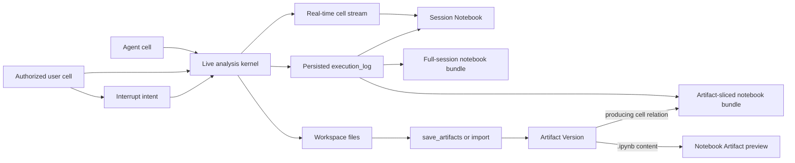
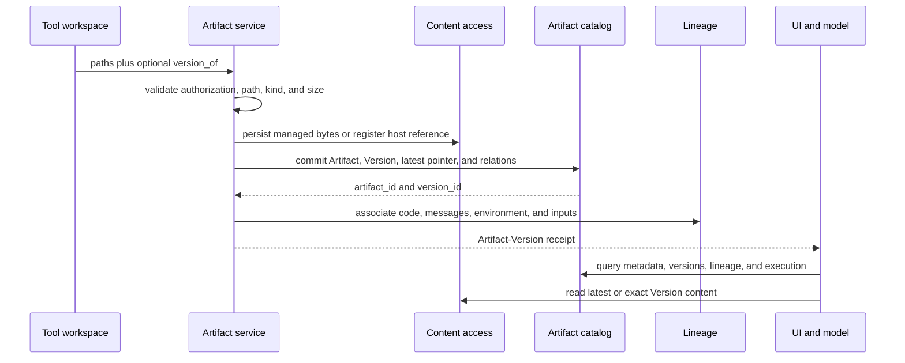
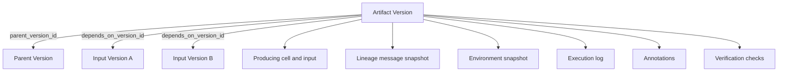
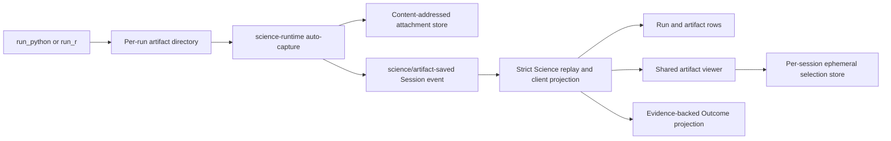

# Claude Science 0.1.25 产物、Notebook 与展示架构、数据流及 DSHscience 对齐

[English](2026-08-22-claude-science-artifact-architecture.md) | 中文

本文描述 Claude Science 0.1.25 的 Artifact、Notebook 与展示模型，以及它们与 `d6f934ae66bd347cc7eb937eb2d2ce9fce65c122` 上 DSHscience 的关系。正文只记录当前架构和交互语义。DSH 对齐部分是设计输入，不是已接受的 DSH 架构决策。

## 结论摘要

Claude Science 把产物组织为一个覆盖会话所属逻辑对象的项目目录。一个逻辑 Artifact 具有稳定身份、可变组织元数据和最新版指针。Artifact Version 记录内容元数据、父版本引用和生产溯源。受管理的 Version 字节不可变；引用型 Version 是显式例外，因为它读取当前获授权、但内容可能变化的宿主文件。

Session Notebook 是独立的执行投影，不是另一个 Artifact 所有者。它在会话根下连接实时 kernel 状态和持久 cell 记录，按 agent frame、环境与 kernel 实例组织工作，并且只允许用户对活动分析 kernel 提交 cell。`.ipynb` 只有在显式保存或导入时才成为 Artifact；打开该文件不会重新连接原 kernel。

依赖边、执行记录、批注、验证结果、文件夹和可复用谱系／环境快照由独立记录管理。会话托盘、项目产物库、查看器标签页、版本导航、编辑器、下载和溯源视图解析同一批共享身份，而不是维护彼此独立的文件卡片模型。

DSHscience 已有更强的字节存储与回放基础：内容寻址的不可变附件、必需的会话事件、严格回放、精确的运行／环境／工具调用溯源、逐 Session 持久语言 kernel、按请求轮次定义的 Artifact Version、有证据支持的 Outcome 修订，以及单一客户端投影。它缺少的是项目级产物组织、更丰富的 Version 关系，以及覆盖现有运行真源的 notebook 读取／导出界面，而非另一套附件、执行日志或查看器权威。

## Claude Science 架构



该架构由七个相互协作的部分组成：

1. **Kernel 执行。** Python、R、shell 和控制面 cell 在某个 agent frame 下运行。活动分析 kernel 向 agent 和获授权的人工终端暴露共享命名空间。
2. **执行投影。** 实时 cell 更新和持久执行记录构成按 agent、环境与 kernel 实例分组的 Session Notebook。它是执行视图，而非已保存的 notebook 文档。
3. **执行工作区。** Cell 和其他工具把普通文件写入任务工作区。工作区文件是临时内容，直到 Artifact 操作将其提升。
4. **产物提升。** `save_artifacts`、导入、上传和人工编辑把内容转成项目 Artifact／Version 记录，并返回稳定身份。
5. **产物目录。** 项目、会话根、Artifact 身份、文件名、优先级、文件夹、保留、最新 Version 和 Version 元数据属于持久目录。
6. **内容与溯源。** Version 指向受管理字节或显式授权的宿主文件引用。Version 祖先关系、依赖、cell 谱系、批注和验证是通过 id 连接的独立记录。
7. **展示。** Session Notebook、会话托盘、项目产物库、查看器、编辑、下载和溯源解析共享的 frame、cell、Artifact 与 Version 身份。HTML 使用与应用 UI 分离的沙箱来源。

## 领域模型

| 记录 | 身份与所有权 | 重要字段 | 生命周期含义 |
|---|---|---|---|
| `frames` | 一个会话或受委派 agent 的执行范围；每个 Session 都有 root frame。 | `id`、`parent_frame_id`、`root_frame_id`、agent 身份、状态、项目所有权。 | 把消息、kernel、cell 和所产 Artifact 归入执行工作的主 agent 或受委派 agent。 |
| 活动 kernel 实例 | 某个 frame、语言和环境下的运行时身份。 | kernel id、frame id、语言、环境、启动／忙碌状态、当前 cell、最后使用时间。 | 管理实时命名空间。结束后命名空间消失，只保留执行记录。 |
| Session Notebook 视图 | 没有独立持久 notebook id 的 root-frame 范围读取模型。 | 选中的 agent frame、环境、活动或已结束 kernel 实例、实时与持久 cell。 | 展示执行，并只允许对活动分析 kernel 提交用户 cell；它不是 Artifact Version。 |
| `artifacts` | 一个项目范围的逻辑对象，绑定生产会话根以及可选 frame／文件夹。 | `id`、`project_id`、`root_frame_id`、`frame_id`、`filename`、`latest_version_id`、上传／临时／分支标志、优先级、文件夹、保留、替代和重命名历史。 | 可变组织元数据和当前 Version 指针；不是内容记录。 |
| `artifact_versions` | 某个 Artifact 下的一次内容发布。 | `id`、`artifact_id`、`version_number`、内容类型、大小、校验和、存储引用、`parent_version_id`、代码／消息／环境元数据、生产 cell、语言、检查点／中间标志。 | 精确的受管理字节或引用型内容描述符，加上生产上下文。`(artifact_id, version_number)` 唯一。 |
| `artifact_dependencies` | 有向的 Version 到 Version 边。 | `artifact_version_id`、`depends_on_version_id`、可选 `reference_name`。 | 输入／数据依赖图；不同于 Version 祖先关系。 |
| `artifact_folders` | 带可选会话绑定的项目层级。 | `project_id`、`parent_id`、`root_frame_id`、会话文件夹和上传文件夹标志、顺序。 | 项目组织以及会话／上传分组。 |
| `content_snapshots` | 内容寻址的谱系或环境快照。 | 哈希、内容、字节数、创建时间。 | 在 Version 间复用相同溯源载荷。 |
| `execution_log` | frame 内一次已持久化 cell／进程记录。 | cell 与 kernel id、环境、语言、cell 输入、stdout／stderr、状态、读写文件、来源、检测和干预。 | 实时 cell 结算后的历史 notebook 内容和 Artifact 生产上下文。 |
| `annotations` | 针对 Artifact-Version 选区或其他支持目标的项目记录。 | 目标种类／键、标签、内容校验和、正文、时间戳。 | 应用编辑前，评审批注和选中文本编辑与 Version 内容分离。 |
| `verification_checks` | 可选绑定 Artifact Version 或 claim 的评审断言。 | 结论、严重程度、证据、反驳、评审者身份／种类、来源引用、状态和解决结果。 | 科学评审生命周期，而非内容版本控制。 |
| `.ipynb` Artifact Version | 内容为 notebook 文件的普通 Artifact Version。 | 受管理／引用型 notebook JSON、校验和、大小和普通 Artifact 溯源。 | 只读文件预览和下载；不管理或恢复实时 kernel 命名空间。 |

以下四种关系含义不同：

- `artifact_versions.parent_version_id` 是内容／编辑祖先关系。数值更大的 Version 可以指向较老父版本，而非紧邻的前一版本号。
- `artifact_dependencies` 是生成某个 Version 时所消费输入的溯源图。
- `artifacts.superseded_by_artifact_id` 连接发生替代的逻辑 Artifact。
- `artifacts.latest_version_id` 是可变的便利指针，不是祖先关系。

## Notebook 架构与数据流

Claude Science 用“notebook”指代两个共享执行溯源、但身份不同的产品：

| Notebook 概念 | 身份与来源 | 可变行为 | Artifact 效果 |
|---|---|---|---|
| Session Notebook | 会话 `root_frame_id`、选中的 agent frame、环境和 kernel 实例；由实时 kernel 状态、实时 cell 更新和 `execution_log` 组合。 | 活动分析 kernel 接受用户 Python／R cell，并与 agent 共享同一命名空间且支持中断。已结束 kernel 和 Agent SDK cell 只读。 | 本身没有效果。Cell 写出的文件在提升前仍是工作区文件。 |
| Notebook bundle 导出 | 从 Session Notebook 执行记录派生，既可以覆盖完整 Session，也可以裁成与某个 Artifact Version 关联的生产 cell。 | 请求时生成的 ZIP，包含 `manifest.json`、`README.md`、`run.sh`、每个纳入 agent／kernel 分段的一份 `notebook.ipynb`，以及适用的 replay、环境、输入和输出文件；它不成为实时 Notebook 的状态。 | 除非显式保存或导入 bundle 或其中的文件，否则没有效果。 |
| `.ipynb` Artifact | 被归类为 notebook 的 Artifact Version 精确内容。 | 对 Markdown、代码、流、错误、富文本和支持图像做只读预览；适用普通 Version 下载／历史规则。 | 它已经是 Artifact Version。打开它不会重新连接 kernel 或改变 Session Notebook。 |



实时 Notebook 先选择主 agent 或受委派 agent 的 frame，再选择环境／语言组，最后选择活动或已结束的 kernel 实例。活动 kernel 的 cell 以实时方式进入与已结算执行记录相同的有序视图。用户提交的 cell 带人工来源，共享所选活动 kernel 的变量与 import，并在结算后进入执行历史。已终止 kernel 仍可作为只读历史选择，但其命名空间已经不存在。

控制面／Agent SDK 执行通道显示为独立只读 notebook 分段。宿主工具记录不是 notebook cell。Shell 执行可以出现在 Session 级执行历史／导出中，但不是交互式共享分析 kernel 终端。

Notebook bundle 导出是一种投影，不是第二套历史存储。两种范围都返回 ZIP，其中包含 `manifest.json`、`README.md`、`run.sh`、每个纳入 agent／kernel 分段的一份 `notebook.ipynb`，以及适用的 replay、环境、输入和输出文件。完整范围包含 Session 的可执行 cell 历史。Artifact 裁剪范围保持同一种归档模型，并通过 Version 的生产 cell 关系选择 cell。Artifact 与精确 Version id 是从 bundle 内 notebook cell 回连内容的持久连接点。

Notebook Artifact 预览读取精确 Version 字节并解析 notebook JSON。它限制预览大小和 cell 数量，净化富 HTML，并在不执行文档的情况下渲染支持的文本／图像输出。因此，编辑或重新运行已保存 `.ipynb` 需要独立计算工作流和一次新的显式 Artifact 保存。

## 展示架构、样式与布局

### 工作区组成

界面把项目导航、活动会话和辅助工作分配给稳定区域。Artifact 与 Notebook 界面复用辅助工作区外壳，但保留各自的选择和生命周期规则。

```text
Wide
┌─────────────┬────────────────────┬──────────────────────────┐
│ Project /   │ Session tabs       │ Artifact / Notebook tabs │
│ session nav │ Conversation       │ Context toolbar          │
│             │ Generated tray     │ Viewer or cell stream    │
│             │ Pinned composer    │ Terminal when live       │
└─────────────┴────────────────────┴──────────────────────────┘

Narrow
┌─────────────┬───────────────────────────────────────────────┐
│ Sidebar /   │ Conversation + composer                       │
│ Library     ├───────────────────────────────────────────────┤
│             │ Artifact Viewer or Notebook                   │
└─────────────┴───────────────────────────────────────────────┘
```

| 区域 | 布局与所有权 | 交互职责 |
|---|---|---|
| 项目／会话导航 | 可折叠前导栏包含项目选择器、创建与发现命令、文件／计算入口和分组会话。 | 改变项目或会话上下文；不管理 Artifact 内容或查看器状态。 |
| 会话工作区 | transcript 上方是 Session 标签页。生成 Artifact 托盘随生产回复出现，composer 保持在会话区域下沿。 | 管理会话上下文以及打开精确 Artifact 或 Notebook 选择的入口。 |
| 辅助工作区 | 后置标签栏承载 Artifact 和 Notebook 工作。Artifact 标签页可以采用单栏或分栏布局，并可合并回单标签栏。 | 容纳聚焦评审与执行视图，而不替代会话。 |
| 上下文工具栏 | 查看器或 Notebook 专属控件位于所选辅助标签内，并紧邻其作用对象。 | 让 Version、溯源、下载、全屏、kernel 和中断操作只作用于活动选择。 |
| 临时状态 | 通知位于上方角落的浮层，不改变三区域几何结构。 | 报告完成与失败，但不成为持久 Artifact 或执行状态。 |

### Artifact 展示

会话通过紧凑托盘展示生成的 Artifact：预览卡片呈现代表性内容和文件名，溢出入口打开其余项目。回复中的内联 Artifact 链接与托盘卡片解析到相同目录身份。托盘与项目产物库选择会在当前工作上方打开 Artifact 模态窗。之后，同一个 Artifact-Version 选择可以在辅助标签页或分栏中打开或激活；模态窗与工作区视图不会维护不同的 Artifact 身份。

Artifact 工作区组合标签身份、小型上下文标题栏以及按媒体类型选择的渲染器。图像和文档预览使用留白充足的中性画布；文本、代码、表格数据和 notebook 文件使用内容专用阅读器。Version 导航与内容／溯源模式属于 Viewer，下载、全屏和关闭操作保留在其工具栏内。项目产物库是独立发现界面，但其中的卡片和行会打开同一个 Artifact-Version 选择。

### Notebook 展示

Session 操作打开用于历史查看和导出的 Notebook 模态窗。标题栏标识 Session root 并汇总 agent／cell 数量；主体按组展示已记录 cell；底栏管理 Notebook bundle ZIP 下载。这个模态窗不提供实时 terminal。

Notebook 工作区标签是操作界面。标题栏标明 Notebook 和所选环境／语言；存在多个候选时增加 agent 与 kernel 实例选择器。主体渲染有序 cell 流。对于活动分析 kernel，界面通过可拖动分隔条把 cell 和共享 terminal 纵向分区；kernel 状态与中断控件保持在 terminal 附近。已结束 kernel 保留相同 cell 展示，但明确变为只读，并说明其命名空间已经消失。

### 视觉系统与响应式行为

| 关注点 | 稳定展示规则 |
|---|---|
| 界面层级 | 白色和灰白工作界面、浅色中性选择填充、细分隔线和小到中等圆角，在不使用厚重装饰的前提下区分导航、transcript、卡片与聚焦工作。 |
| 颜色与状态 | 克制的强调色标识链接和活动控件。运行、忙碌、错误和已结束状态会把颜色或圆点与文本或徽标配合使用，而不只依赖颜色。 |
| 字体 | 无衬线文字承载导航、会话、标签和元数据。等宽文字承载 cell 代码、标识符、kernel 输出和 terminal 内容。 |
| 密度 | 导航和生成 Artifact 托盘保持紧凑；transcript 保持阅读宽度；Artifact 画布为媒体留出空间；Notebook cell 与 terminal 控件保持高信息密度。 |
| 控件层级 | 持久导航使用图标加文字控件。紧凑工具栏操作在具有无障碍名称或提示时可以只使用图标。控件保留在其所改变状态所属的区域内。 |
| 媒体处理 | 缩略图卡片支持快速识别，Viewer 则居中展示所选媒体并保持宽高比。富 HTML 在与应用外壳不同的沙箱来源上渲染。 |
| 响应式布局 | 当水平空间不足以维持宽屏布局时，辅助工作区堆叠到会话下方，项目／产物库控件独立收拢。重排只改变位置，不改变 Artifact-Version 或 Notebook-kernel 身份。 |

## 产物创建与保存数据流

`save_artifacts` 接受以下操作模型：

```text
save_artifacts({
  files: string[],
  language: "python" | "r" | "bash" | "text",
  version_of?: Record<string, artifact_id | version_id>,
  environment?: string,
  checkpoints?: string[],
  destination?: Record<string, "snapshot" | "working_data">
})
```

一次调用只使用一种语言。`version_of` 把文件名显式映射到 Artifact 或 Version；调用方不得从相似文件名推断。`checkpoints` 标记重建成本高的序列化状态，而非展示输出。`destination` 声明保留意图。



提升会拒绝授权工作区或宿主授权之外的路径、空文件或不可读输入以及不支持的文件种类。内容和元数据以同一个已提交 Artifact-Version 操作共同变得可见；失败的提升不会把无内容 Artifact 暴露为已完成结果。

受管理内容具有校验和；当校验和与大小在同一项目中匹配时，可以复用现有内容位置。去重共享物理字节，但不合并 Artifact 或 Version 身份。引用型 Version 则保存宿主引用，并在读取时重新校验当前授权和路径包含关系；它不能证明所引文件仍与保存时的校验和字节相同。

没有 `version_of` 时，保存按项目、生产 frame 和文件名解析逻辑 Artifact，或创建新 Artifact。提供 `version_of` 时，它把所指 Artifact 或精确 Version 记录为基线。陈旧基线仍可产生下一个数值 Version，同时保留显式的较老父版本；内容不会自动合并。

操作返回 Artifact 和 Version id、版本号、文件名、内容类型、大小、校验和、内容位置、检查点状态、环境、会话根和保留信息。模型可见 Markdown 可以使用 `{{artifact:VERSION_ID}}` 固定精确 Version。

## 产物操作与交互语义

| 操作 | API 操作 | 语义 |
|---|---|---|
| 项目和会话列表 | `GET /api/projects/{project_id}/artifacts`、`GET /api/frames/{root_frame_id}/artifacts` | 项目产物库和会话托盘查询同一批目录身份；中间项和用户隐藏项不进入正常展示。 |
| 最新和精确内容 | `GET /api/artifacts/{artifact_id}`、`GET /api/artifacts/versions/{version_id}` | 最新读取跟随可变指针；精确 Version 解析所指版本。受管理内容稳定，宿主引用内容可能在目录之外变化。 |
| 元数据和历史 | `GET /api/artifacts/{artifact_id}/metadata`、`GET /api/artifacts/{artifact_id}/versions` | 展示元数据和有序 Version 历史是不同查询。 |
| 人工文本保存 | `POST /api/artifacts/{artifact_id}/versions` | 从内容、内容类型和显式 `parent_version_id` 创建 Version。 |
| 重命名和优先级 | `PATCH /api/artifacts/{artifact_id}/rename`、`PATCH /api/artifacts/{artifact_id}/priority` | 改变逻辑 Artifact 元数据，不创建内容 Version。 |
| 复制 | `POST /api/artifacts/{artifact_id}/copy` | 在版本 1 创建新的分支 Artifact，并可共享源内容位置。 |
| 组织 | 文件夹操作、逐 Artifact 文件夹操作和 `POST /api/artifacts/bulk-move` | 在不改变内容的情况下，在项目层级中移动逻辑 Artifact。 |
| 溯源 | Artifact／Version 谱系操作和 frame 执行日志查询 | 独立于内容获取生产上下文。 |
| 批注和编辑 | Artifact-Version 批注、`suggest-edits` 和 `apply-edit` 操作 | 把评审锚定到精确 Version；应用内容会创建 Version，而不是修改已存受管理字节。 |
| 实时 Session Notebook | Session kernel 查询、执行日志查询和实时 cell／控制通道 | 按 root frame、agent frame、环境和 kernel 实例合并实时及已结算 cell；用户执行和中断只面向所选活动分析 kernel。 |
| Notebook bundle 导出 | `GET /api/frames/{root_frame_id}/bundle?scope=full` 或 `scope=sliced&versionId={version_id}` | 为完整 Session 或一个 Artifact Version 关联的 cell 返回 ZIP，其中包含逐 agent／kernel notebook 与执行支持材料，并且不创建 Artifact 或新的执行历史。 |
| Notebook Artifact 预览 | 对 `.ipynb` 内容读取精确 Version 文本 | 在普通 Artifact 下载与 Version 规则下渲染有界、净化且不执行的预览。 |
| 下载／导出 | 最新／Version 下载、选中项 zip、会话 zip 和云传输操作 | 流式提供目录内容，不让查看器成为存储所有者。 |

版本号表示时间顺序；`parent_version_id` 表示编辑祖先关系。例如，v2 和 v3 可以都把 v1 作为父版本。版本步进器可以按数值顺序移动；祖先关系和默认父版本 diff 则跟随父链接。

复制和重命名对身份的影响不同。复制创建从版本 1 开始的新 Artifact 身份，并可与源共享内容。重命名改变逻辑 Artifact 文件名，不改变其 Version。

## 保留与内容语义

| 机制 | 架构规则 | 产品后果 |
|---|---|---|
| 受管理 Version | 内容由服务管理并通过其 Version 寻址。 | 适合作为不可变科学证据和持久发布。 |
| 宿主引用 Version | 内容从当前获授权的宿主路径读取；授权和包含关系会重新校验，但不保证字节未变化。 | 将其作为不可变证据前应先物化或校验完整性。 |
| `snapshot` 保留 | 在正常保留策略下，每个已保存 Version 都保持可寻址。 | 适合结果、报告、图形和可审计输出。 |
| `working_data` 保留 | 成功保存后会请求裁剪到最新工作副本。清理失败不会回滚新 Version，因此裁剪是尽力而为。 | 它是保留意图，不是严格存储或历史上限。 |
| 中间 Version | `is_intermediate` 让内部工作不进入正常项目／会话列表。 | 调试残留不会自动成为面向读者的输出。 |
| 检查点 | `is_checkpoint` 标记用于避免昂贵重建的序列化状态。 | 它是运行时／溯源状态，不是展示类别。 |
| 内容去重 | 同项目内校验和与大小匹配的受管理内容可以共享存储，而逻辑 id 仍不同。 | 删除和垃圾回收必须感知引用。 |

用户上传和分支副本保留 Version 历史，不使用 `working_data`。超大可变工作集应放在用户管理的存储中，除非产物操作声明了适当 destination。

## 溯源与评审

Claude Science 分别维护 Version 祖先关系和数据依赖图：



谱系可以携带生产 cell、会话片段、环境状态、输入映射和依赖边。可复用消息／环境载荷采用内容寻址。谱系结果可以完整、待处理或部分映射，而不会改变 Version 的内容身份。

执行记录管理 cell 输入、环境／内核事实、stdout／stderr、读写文件、来源、检测和用户干预。验证记录独立地把结论、证据、反驳、评审者和解决状态附加到 Version 或 claim。批注使用 Version 和内容校验和检测陈旧选区。

## 统一交互模型

交互统一的原因是每个入口都解析相同领域 id：

- 工具保存返回 `artifact_id` 和 `version_id`；会话托盘展示该精确 Version。
- 项目产物库查询各生产会话中的 Artifact，并通过文件夹、搜索、优先级和上传组织它们。
- 模态和分栏查看器打开同一个 Artifact，并固定或切换精确 Version；它们不会复制托盘卡片状态。
- 编辑创建 Version，重命名改变 Artifact 元数据，复制创建新 Artifact，批注创建独立锚定评审记录。
- 溯源和“在上下文中查看”把 Version 连接回生产会话、cell、消息、环境和输入。
- Session Notebook 按会话根与 kernel 选择打开；Artifact 按精确 Version 打开。生产 cell 关系在不合并身份的前提下连接两者。
- 完整和按 Artifact 裁剪的 Notebook 下载是派生 ZIP bundle。Bundle 或其中的 `.ipynb` 只有通过显式 Artifact 操作才进入目录。
- 文件系统浏览器保持独立：导入会把文件系统条目提升到 Artifact 目录，而不是把可变文件系统当作产物库。

视觉一致性来自该身份模型。没有共享 id 和操作语义的查看器外壳仍是另一套产品模型。

## DSHscience 当前架构

在 `d6f934ae66bd347cc7eb937eb2d2ce9fce65c122` 上，DSH 分离了四个权威：



| DSH 组件 | 当前所有权和语义 |
|---|---|
| [`@deepseek-ai/dsh-attachment-local`](../../packages/attachment/attachment-local/README.md) | 不可变 SHA-256 对象、原子持久发布、跨媒体字节去重和校验读取。会话日志包含不透明引用，而非宿主路径。 |
| [`@deepseek-ai/dsh-science-runtime`](../../packages/science/science-runtime/README.md) | 持久 Python／R 执行、逐运行产物目录，以及在终止运行事实后对允许图像／文本文件的有界自动捕获。捕获失败不会改变已提交的运行结果。 |
| [`@deepseek-ai/dsh-science-session`](../../packages/science/science-session/README.md) | 必需的 `science/*` 事件、严格回放、品牌化 id、完整 Artifact Version 值、精确运行／环境／工具调用溯源、浏览器安全投影和附件授权。 |
| `annotate_artifact` | 复用精确附件，并替换所指投影 Version 的标题／说明元数据；它不创建重复字节或读者可见的内容 Version。 |
| `publish_outcome` | 追加连续 Outcome 修订，精确引用成功运行、Artifact Version 和／或先前消息。Outcome 是基于证据的发布，不是字节存储。 |
| [`@deepseek-ai/dsh-client-ui-science`](../../packages/client/ui-science/README.md) | 为 transcript 条目、画廊、标签页、Version 导航、内容、下载和溯源读取一个 Science 投影。其逐会话存储只管理查看状态。 |
| Notebook 界面 | 已有持久 Python／R kernel 及其 `kernelEpoch` 身份，但没有实时 Session Notebook、直接人工 cell 通道或完整／裁剪 Notebook bundle 导出。Cell 输入和输出展示当前把 Science 运行事实连接到 transcript 工具出现记录，而不是读取独立 notebook 记录。 |

DSH 根据 [按请求轮次定义 Artifact Version 的决策](../../.agents/notes/implemented/architecture/2026-08-19-artifact-version-per-request-turn.md)，把 Artifact Version 定义为一个请求轮次产生的内容。自动捕获跳过字节相同的输出；同一工具调用轮次内重复写入的变化输出会替换投影 Version，而较晚轮次的变化输出会打开下一个连续 Version。每个保存事件仍保留在 Session 日志中。元数据策展保持 Version 号和字节不变。

DSH Artifact 目前只在 Session 范围内存在。Science 领域尚无项目 Artifact 目录、文件夹／上传／复制／重命名生命周期、显式父 Version 链接、Version 依赖图、锚定人工批注、验证记录或项目范围的保留／垃圾回收策略。这些是产品缺口，而不是替换附件存储或 Session 投影的理由。

## Claude Science 与 DSH 比较

| 维度 | Claude Science 0.1.25 | `d6f934a` 上的 DSH | 对齐输入 |
|---|---|---|---|
| 主要范围 | 具有生产会话所有权的项目目录。 | 只有 Session 投影。 | 增加项目目录／索引，但不复制 Session 生产真源。 |
| 逻辑身份 | 稳定 Artifact id；文件名、文件夹、优先级、保留和最新指针可变。 | 稳定 `ScienceArtifactId`；逻辑名和展示元数据位于投影 Version 上。 | 在项目操作前引入明确的逻辑 Artifact 元数据所有权。 |
| 版本语义 | 每次保存／编辑创建数值 Version；显式父版本可以从较老 Version 分支。 | 每个请求轮次一个读者可见 Version；同轮次保存和元数据策展会替换投影。 | 保留 DSH agent 语义；为跨轮次和人工内容编辑增加显式父版本。 |
| 内容存储 | 受管理 Version 内容加可选宿主引用内容；受管理内容可以在项目内去重。 | 具有校验引用的全局内容寻址不可变附件存储。 | 保留 DSH 存储；把任何外部引用建模为独立的非不可变内容类别。 |
| 创建边界 | 工作区内容通过保存、导入、上传或人工编辑持久化。 | 运行结算后自动提升符合条件的运行产物文件。 | 保留自动捕获这个生产方，并让它使用共享产物操作。 |
| Session Notebook | 按 agent／环境／实例组织实时与已结束 kernel；活动分析 kernel 接受人工 cell；完整和按 Version 裁剪的 Notebook bundle 从执行历史派生。 | 有逐 Session 持久 Python／R kernel 和持久运行／kernel 身份，但没有统一 Notebook 视图、人工 cell 执行或 Notebook bundle 导出。 | 在 Session 和 transcript 真源之上构建读取／bundle 导出投影；不要创建第二套执行历史。 |
| `.ipynb` Artifact | 已保存 notebook 文件是普通 Version，具有有界、不执行的预览。 | `.ipynb` 当前不是允许自动捕获的媒体类型，也没有专用 Science 查看器。 | 把 notebook 文件作为显式受管理 Artifact，与实时执行视图分开。 |
| 溯源 | 父图、依赖图、cell／消息／环境谱系和执行日志。 | 精确的运行、请求、工具调用、环境、代码哈希、内核 epoch 和 transcript 连接。 | 保留 DSH 坐标，并增加类型化依赖／父关系。 |
| 人工编辑 | 文本编辑创建 Version；批注和 apply-edit 感知 Version。 | 只读查看器；`annotate_artifact` 是元数据策展。 | 把内容编辑和元数据策展视为不同操作。 |
| 组织 | 项目文件夹、会话文件夹、上传、搜索、星标／隐藏、复制、重命名、删除／导出。 | 单 Session 内最新版画廊。 | 项目组织属于目录能力，而非客户端查看状态。 |
| 展示 | 会话托盘、项目产物库、共享查看器、精确 Version 导航和溯源。 | transcript 行和一个基于 Session 投影的 Details 查看器。 | 在各入口间复用一个 Artifact 引用及查看器注册项。 |
| 布局与视觉层级 | 可折叠项目／会话导航、会话工作区和带标签页的辅助工作区；窄屏把聚焦工作堆叠到会话下方。 | 带可选 Details 面板的会话外壳；Science 内容使用共享客户端主题和查看器注册项。 | 增加产物库与 Notebook 入口时复用同一响应式外壳和主题词汇；不要创建平行 Artifact 查看器。 |
| 发布 | Artifact 是一等对象；验证附着 Version。 | Outcome 是独立的证据支持发布修订。 | 保持 Outcome 独立，并让导出引用或物化 Artifact。 |
| 保留 | 快照、尽力而为的工作数据裁剪、中间／检查点类别、项目去重。 | 捕获上限；附件对象无限期保留。 | 增加显式保留和感知引用的垃圾回收，不削弱不可变证据。 |

## 建议的统一语义

本节是未来拟议 Agent Note 的输入，不是当前 DSH 权威。

### 分离记录和所有者

| 记录 | 建议所有者 | 必需含义 |
|---|---|---|
| Artifact | 项目 Artifact 目录 | 稳定逻辑身份、项目／Session 所有权、显示名、文件夹、用户优先级／可见性、最新发布 Version。 |
| Artifact Version | 持久 Science／Session 事件加项目索引 | 受管理的不可变附件引用、产品 Version、可选父 Version、精确生产运行／轮次／工具／环境、来源、媒体元数据和创建时间。 |
| External Content Reference | 文件系统／授权能力 | 具有当前授权和完整性状态的显式可变宿主内容；未物化前绝不展示为不可变 Version blob。 |
| Notebook Execution View | Science Session 查询／投影能力 | Root Session、精确运行／工具调用、语言、kernel epoch、cell 输入／输出出现记录、实时状态和可选人工 cell 来源；没有独立持久 notebook id。 |
| Dependency Edge | 产物溯源服务 | 精确 Version 间的类型化 `depends-on` 边以及引用名和解析状态。 |
| Annotation and Verification | 评审服务 | 精确 Version／校验和锚点、作者／评审者、状态以及可选的应用编辑结果 Version。 |
| Outcome | Science 发布领域 | 引用精确运行、Artifact Version 和消息的不可变修订；绝不是最新内容的可变别名。 |
| Viewer State | 客户端包内存储 | 仅管理打开标签页、活动 `artifactId@version`、内容／溯源模式、选区和灯箱状态。 |

Session 事件继续作为运行产出和模型发布的真源。项目目录管理跨 Session 发现和可变组织事实，同时索引不可变受管理 Version 引用。附件提供方继续作为受管理字节权威。浏览器不拥有任何持久 Artifact 事实。

### 操作矩阵

| 用户或 agent 意图 | 统一操作 | 版本效果 |
|---|---|---|
| Agent 在一个请求轮次内重复写入相同逻辑输出 | 记录每个事件，只投影同轮次最终值。 | 保持当前产品 Version 号；保留的事件历史保存迭代。 |
| Agent 在较晚轮次改变输出 | 基于最新版或显式基线保存。 | 创建带父引用的下一 Version。 |
| 人工编辑 Version 内容 | 基于正在查看的 Version 显式保存编辑。 | 创建以所看 Version 为父的 Version；暴露陈旧基线分支／冲突，而非暗示前一版本号就是其父。 |
| 模型或人工只改变标题／说明 | 用自身溯源策展逻辑／Version 元数据。 | 不创建内容 Version。 |
| 用户重命名、星标、隐藏或移动 | 改变项目目录元数据。 | 不创建内容 Version。 |
| 用户复制 Artifact | 创建带复制／分支溯源边和共享受管理 blob 引用的新逻辑 Artifact。 | 新 Artifact 从版本 1 开始；源不变。 |
| 用户批注某个选区 | 创建锚定到精确 Version 加校验和／范围的批注。 | 应用编辑前不创建 Version。 |
| 用户应用批注编辑 | 调用人工编辑操作。 | 创建子 Version，并把批注保留为评审溯源。 |
| Agent 发布结果 | 使用精确引用发布 Outcome。 | Outcome 修订独立递增；所引 Artifact Version 保持固定。 |
| 用户打开 Session Notebook | 把 Session、运行和 kernel 身份解析为实时／历史执行视图。 | 不创建 Artifact Version；不复制执行记录。 |
| 用户导出完整或按 Artifact 裁剪的 Notebook bundle | 从精确运行／cell 记录物化派生 ZIP，其中包含逐分段 notebook 与适用的执行支持材料。 | 除非用户显式保存／导入 bundle 或其中的文件，否则不创建 Artifact Version。 |
| 用户把 `.ipynb` 保存为项目输出 | 通过共享 Artifact 操作提升 notebook 字节。 | 创建或推进 Artifact Version；文件仍与实时 kernel 命名空间分离。 |

该混合规则保留 DSH 的请求轮次历史，同时增加显式编辑祖先关系。数值序列表示顺序；父字段表示祖先关系。

### 共享交互引用

Artifact 入口交换一个可序列化选择：项目 id、Artifact id、精确 Version id 或版本号，并且只有确实需要实时跟随时才使用显式的跟随最新标志。Notebook 入口则交换 root Session／frame、相关时的精确运行或 cell、语言以及 kernel 实例／epoch。生产 cell 关系是这些选择之间的显式连接；文件名和显示顺序不是连接键。transcript 引用和 Outcome 引用固定精确 Version。项目卡片在打开前可以跟随最新。重命名／文件夹／优先级命令面向 Artifact；编辑／下载／溯源／批注命令面向精确 Version。

项目产物库、会话托盘、Outcome 引用、搜索结果和查看器调用同一目录／查询能力，并打开同一个查看器注册项。Session Notebook 调用一套执行查询／投影，并把持久记录与实时 kernel 更新组合。宽屏、分栏、模态和窄屏堆叠布局保留这些选择，而不是创建布局局部副本。任何入口都不从工具结果文本、文件名或私有卡片缓存重建 Artifact 状态，notebook 状态也绝不成为竞争性的 Artifact 目录。

### 最小溯源集

DSH 受管理 Version 保留 `runId`、`toolCallId`、`requestHeaderSeq`、环境修订／指纹、代码哈希和内核 epoch，再增加 `parentVersionId`、`producingCellId` 或等价精确运行／cell 连接、类型化依赖边、来源以及项目／Session 所有权。可选消息／环境快照保持内容寻址且有界。执行输入和输出继续由 Session／transcript 运行记录管理并按 id 连接；Notebook bundle 会快照这些记录，但不成为其权威。

### 保留与垃圾回收

保留 DSH 的 SHA-256 附件对象，并把策略应用到引用：不可变证据快照、可替换工作数据、检查点和中间项可见性。只有每个 Session 事件、项目 Version、Outcome 导出、批注编辑和外部引用都释放对象后，垃圾回收才能删除它。项目复制增加引用，而非复制字节。任何策略都不得裁剪 Outcome 或验证记录引用的 Version。

### 能力封装

项目 Artifact 目录是完整能力 seam：用于 Artifact／Version 查询和命令的 Service Definition、用于持久项目元数据和索引的 Provider，以及用于捕获／导入工具和客户端入口的 Consumer。附件服务继续作为字节 seam；Science Session 继续管理生产事件；ui-science 继续作为 Consumer。

## 建议的实现切片

1. **领域决策。** 编写拟议 Agent Note，定义 Artifact、Version、受管理 Blob、外部引用、请求轮次与人工编辑的版本语义、命令目标、关系类型以及 Outcome 分离。
2. **项目目录 seam。** 增加 Service Definition、本地 Provider、回放／索引协调、品牌化 id 和授权，先不改变查看器。
3. **生产方集成。** 让自动捕获和未来导入／上传返回同一种 Artifact-Version 回执，同时保留 Session 事件和内容寻址附件。
4. **Notebook 读取模型与导出。** 组合 Session 运行／kernel 事实与 transcript cell 输入／输出出现记录，再增加 root-Session 执行视图和确定性的完整／裁剪 Notebook bundle ZIP 导出。任何未来的直接人工 cell 通道都保持独立授权并持久记录。
5. **统一客户端入口。** 增加项目产物库和会话生成托盘，通过同一个 `artifactId@version` 选择打开现有查看器；让精确生产运行链接打开 Notebook 视图，在宽屏与堆叠布局间保留选择，并保持文件系统浏览独立。
6. **人工操作。** 增加重命名／文件夹／优先级／复制，再增加精确 Version 编辑和锚定批注；每项都通过组装应用路径完成。
7. **溯源与保留。** 在身份和授权稳定后，增加父／依赖视图、感知引用的保留／垃圾回收，以及验证集成。

每个切片都同步更新包 README 和 JSDoc，为无效转换增加单元覆盖，通过 e2e 覆盖验证持久化和附件授权，并为模型或产品可见行为更新无密钥组装应用 snapshot。

## 被拒绝的捷径

- **把工具结果附件当作 Artifact 模型。** 工具结果是 transcript 中的出现记录；它们无法管理项目组织、跨 Session 发现、编辑或稳定的最新／Version 语义。
- **使用文件名作为身份。** 重命名、复制、同名文件和显式分支都要求独立于路径和显示名的 id。
- **在客户端或查看器中存储 Artifact 字节。** 这会复制授权、持久性、完整性和缓存所有权。
- **把宿主文件系统浏览器当作 Artifact 库。** 工作区文件是可变执行输入；Artifact 是具有溯源和发布语义的已提升结果。
- **用 Artifact-id 路径布局替换 DSH 内容寻址存储。** 项目身份属于元数据，内容身份属于附件存储。
- **因标题／说明改变而推进内容 Version。** 仅元数据策展会重新引入重复的读者历史。
- **让最新版本代替证据。** transcript 生产记录、Outcome 引用、批注、diff 和验证都固定精确 Version。
- **把实时 Session Notebook 做成已保存 Artifact。** 实时执行状态、派生 Notebook bundle 和不可变 `.ipynb` 文件具有不同身份与生命周期。

## 范围限制

- 本文覆盖 Claude Science 0.1.25 的本地产物领域；云传输、远程计算、多用户协调和账号生命周期不在范围内。
- Claude Science 引用型 Version 只有在物化字节或依据持久完整性值重新校验后，才能作为不可变科学记录。
- `working_data` 表示保留意图和尽力而为的裁剪；它不是严格历史或磁盘用量上限。
- 谱系可以待处理或部分映射，因此消费方必须处理不完整依赖以及不可用的执行／评审记录。
- Session Notebook 是执行投影；只有显式提升的 `.ipynb` 才是 Artifact Version，Artifact notebook 预览也绝不恢复实时命名空间。
- 展示部分记录区域所有权、视觉层级和响应式行为，而不是像素规格或主题 token 清单。
- DSH 建议需要先形成拟议 Agent Note 并通过评审，才能进入实现。
